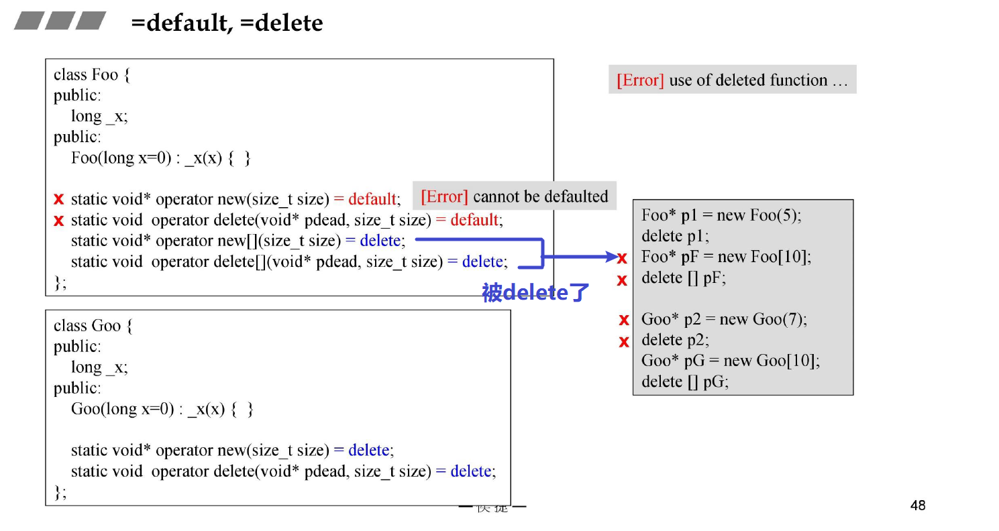

# C++11新特性

## variadic template

参考[C++基础知识](./C++基础知识.md)

## auto

### auto的使用

### 不是什么时候都 直接 用auto

**如上所示，auto& 可以将乘完 3 后的元素放回容器中去**

## 基于范围的 for 循环

如上一节图所示

其实引用就是指针，只是表现形式不同。具体参考[C++基础知识](./C++基础知识.md)

## =default ， =delete

其使用的方法如下图所示：

测试代码如下：

## alias template 模板的化名

待补充
