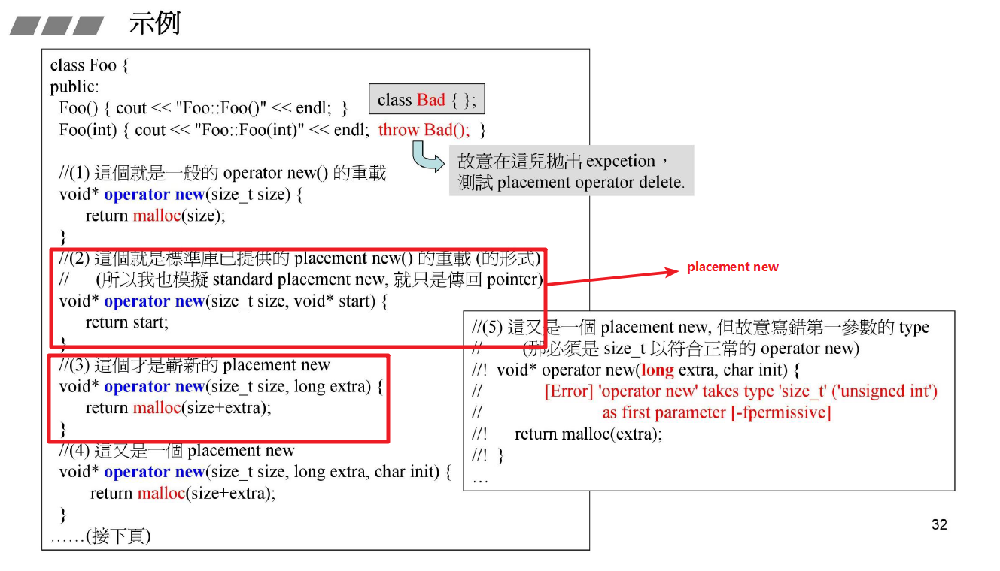
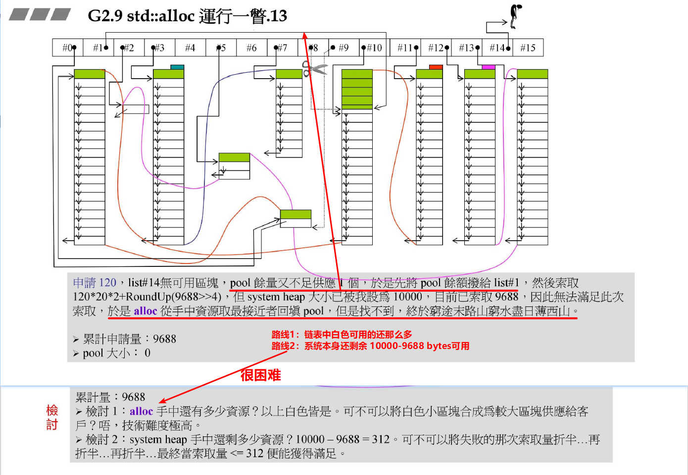
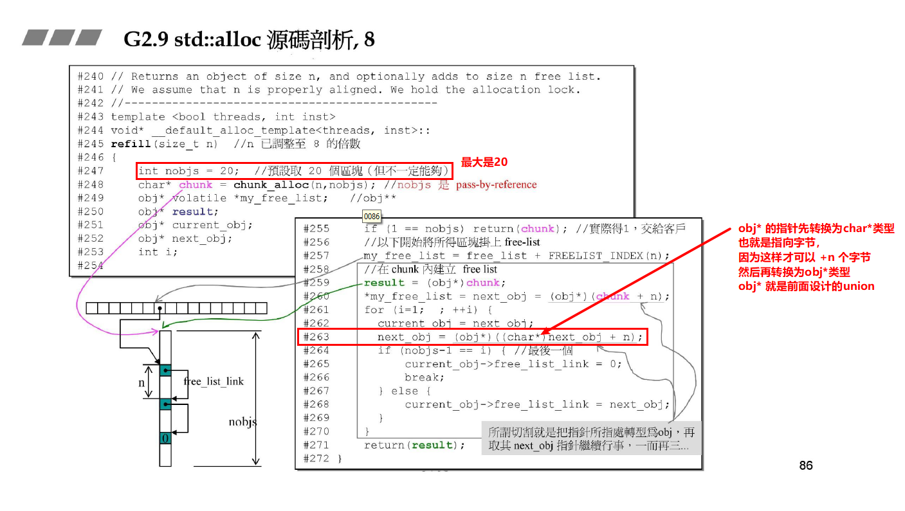
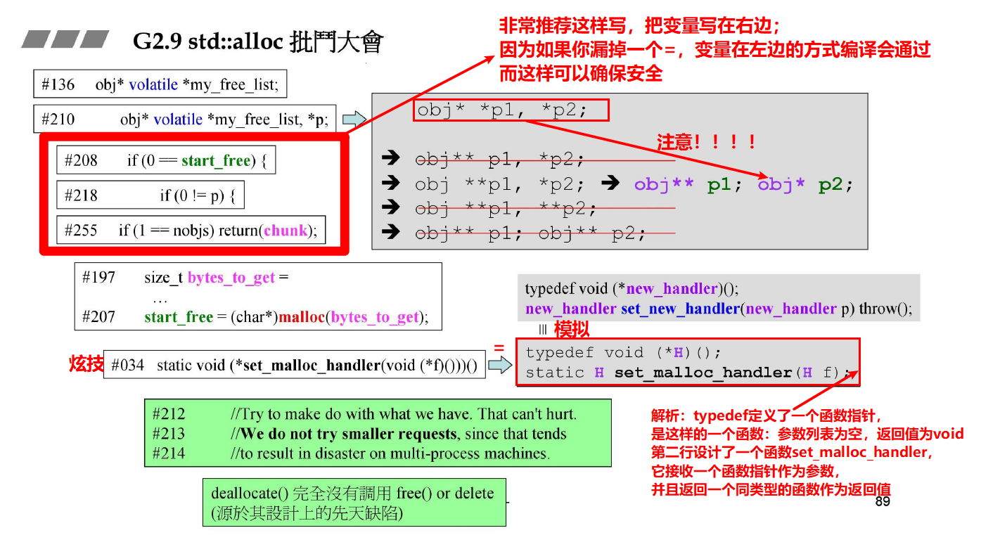
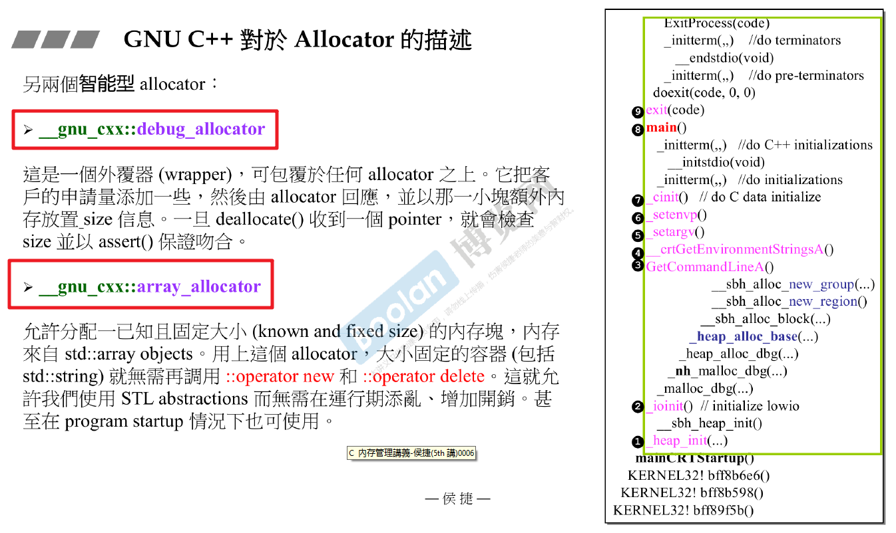

# 内存管理

## 学习大纲&概览

### 上述 4 个Primitives 的使用举例

- 这里的 primitive翻译为 原生的 比较好，指的是 C++原生的东西

`注`

​	上述GNUC 的版本是GNUC 2.9版本的，在GNUC 4.9版本中，已经变的和其他的正统一样了；而原来的那个alloc的换了个名字（pool_alloc）

​	上述也是GNUC 的其中两个分配器，其实GNUC一共有7、8个分配器。

## new expression & delete expression

- new 是一个表达式，在new 的后面应该加上 class name

- new 的行为模式实际上是分为了以下三步

  

- delete 的行为模式实际上被划分为以下两步

  

## array new & array delete

- 使用方法以及 delete 不带 `[]` 的后果

  

- 小测试如下：

  

例如，在下面的例子中，加不加[]是一样的，析构函数没有意义

## placement new

`placement new 允许我们将对象构建于 已经 allocated 的内存中`

## 重载 operator new

### 重载的方式

### 重载new() delete()

- 这其中有一个容易混淆的地方是：new() 是placement new接收一个指针参数，但是我们不仅可以放一个指针，其实还可以重载放更多的参数；

- 我们可以重载 class member operator new()，写出多个版本，其中`第一参数必须是 size_t`*（用来接收对象大小）

  

  标准库中的字符串的重载例子：

  

- 我们所重载的 operator delete()，不会被delete调用；只有当new所调用的Ctor抛出exception时，才会调用这些重载的operator delete()，用来完成未能完全创建成功的对象所占用的内存

## new handler

其自己书写的例子如下：

- 参考[typedefine 相关](./C++基础知识.md)

## 内存池的设计

**目标1：加快速度，一次申请一大块内存池，切成小块供使用**

**目标2：节约空间，每一次申请的一大块内存池带有cookie，每一小块不带cookie**

### 设计方法一：per-class allocaotor，1

- 上述例子可以看到：`内存池使用链表来管理`

测试程序如下：

### 设计方法二：per-class allocaotor，2 ★

和第一个版本的唯一差别在于，使用了`内嵌指针 embedded pointer` ，使用低位的4个字节来指示freestore，在申请和归还时使用：

### 设计方法三：static allocator ★★

更进一步的，为了避免在每一个类里面都要像版本2一样做重载，直接把内存池这一设计抽象出来，设计成一个类

首先其使用的方法如下图：

设计如下：

其测试结果为：

`总结`

​	每个allocator维护一条链表，这个allocator是专属于某个类的。

### 设计方式四：macro for static allocator

- 和版本三原理完全相同

## malloc概述

### malloc在内存中的基本占用情况

- 可以看到在申请内存较小的时候浪费很大，都浪费在 cookie 和 overhead 上了

- 因此要考虑去除 cookie，但是要去除 cookie 的先决条件是，每一块的大小都一样，否则怎么能去除；

  于是就考虑到了容器（里面每个元素大小都一样）

### allocator

无论是在VC，BC，还是GNC中，allocator的实现都如同下图所示一样：

没有任何的特殊设计，只是调用了 ::operator new ，然后内部调用 malloc，导致每一小块都带有 cookie；

但是不同的是，GNC中的容器虽然实现了allocator，但是容器并没有用它（如上图所示）

`而是用了另一个很棒的类 alloc`，如下图所示：

在GNC4.9版本中，这个好东西被换了一个名字，如下图所示：

## 第二讲 GNU std::alloc 

### std::alloc 的原理

- 在前面第一讲中，我们自己写的分配器中，让这个分配器变成某一个类的专属的分配器，只维护一条自由链表，专门为它服务
- 现在，把这些自由链表全部收集在一起，一共16条，16种大小，超过最大的alloc将直接调用malloc

### std::alloc 运行流程

接下来，我希望看看把内存用到用光，直到分配失败，会发生什么：

最终，向右也无法找到：

### std::alloc 源码剖析

所以第一级的代码不再看，

第二级开始：重要

下图是补充的上图

其中 `refill()`函数如下图所示：

**chunk_alloc()函数的分析：**

接下来是类外的静态成员变量的定义：

### GNU2.9 std::alloc 观念大整理 ★★★

- **但是，这种设计是有先天缺陷的，也就是之前 malloc() 分配出去的内存的cookie那里已经没有指针了，也就是如果想要 free() 的话是没有指针指向的了**

- **容器调用分配器进行内存分配时， 不会直接使用array new进行内存分配；即使要分配一块大内存，也会进行多次的内存获取再乘起来**

`注意`

如上图所示：list中的每个节点的大小为 元素double 4 字节 + 2个list指针 8字节 = 16字节

### GNU4.9 中使用 pool allocator 和不使用时间的对比

## 第三讲 VC malloc 内存分配

### 总体流程

### SBH小区快机制 & 第一次内存分配

### 后续第2次....的内存分配流程

### 第一次面对回收的动作

### 再一次的分配

### 合并

所以每一个被malloc分配出去的内存都带着8字节的上下cookie

### 回收时的确认顺序

## GNU allocator 和 VC malloc（2+3讲小结）

## loki::allocator

- 因为GNU allocator的分配器非常霸道，不会还给操作系统内存，因此，介绍下面的 Loki Library下的allocaotr

### 概述：包含有3个重要的classes

## 其他的一些分配器（7种）

### array_allocator

### 最精巧的两个分配器总结

