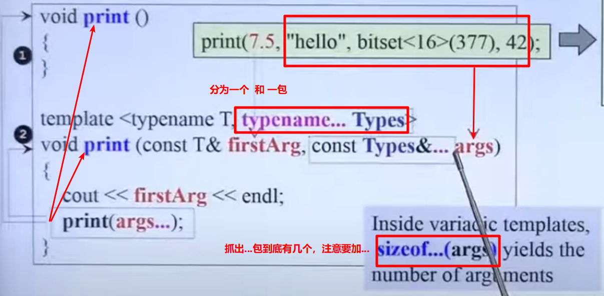
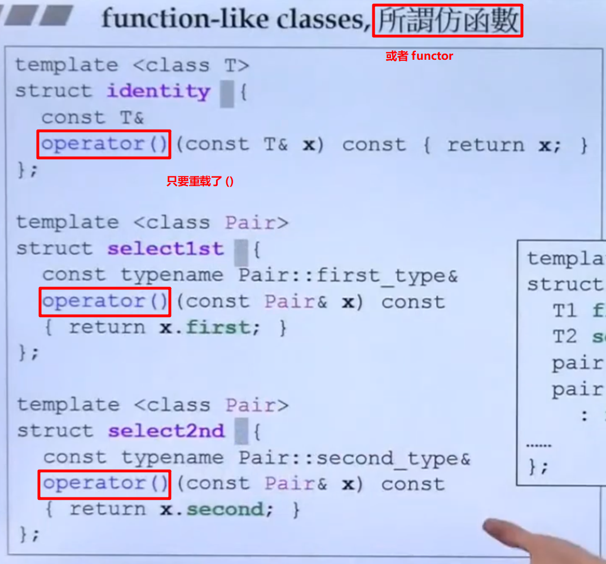
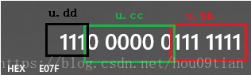

# 												C++基础知识「侯捷课程」

## 基于对象、面向对象

1. **基于对象**
   - **无指针的类   complex**
   - **带有指针的类  string**

2. **面向对象 OOP**
   - **继承 Inheritance**
   - **复合 Composition**
   - **委托 Delegation (composition by reference(这里的reference指的是指针))**

## 头文件布局

```C++
#ifndef _COMPLEX_
#define _COMPLEX_

// 0 前置声明
#include <cmath>
class ostream;
class complex;
inline complex& _doapl(complex& ths, const complex& r){};

// 1 类声明
class complex{
    ...
};

// 2 类定义
complex::function...

#endif
```

## namespace 名字空间

- 防止同名，包装在 `namespace` 内就不会打架
- 可以分段来写
- 使用方式：
  -  using directive
  - using declaration

```C++
// using directive 一下全打开
#include <iostream.h>
using namespace std;
int main(){
	cin << ...;
	cout << ...;
	
	return 0;
}
```

```C++
// using declaration 部分打开
#include <iostream.h>
using std::cout;
int main(){
	std::cin << ...;
	cout << ...;
	
	return 0;
}
```

```C++
// 一行行打开
#include <iostream.h>
int main(){
	std::cin << ;
	std::cout << ...;
	
	return 0;
}
```

## Reference 引用

`必须在声明引用时将其初始化，而不能向指针那样，先声明，再赋值`

`并且，一旦引用了某个值后，就不能再引用成另一个值了`


### 从内存的角度看 值、引用、指针


### 引用的常见用途

`reference就是一种漂亮的pointer`

> reference 通常不用于变量声明，而用于参数类型和返回类型的描述


但是需要特别注意的是：


`上述不能被认为是函数的重载，会造成ambiguity`


## #define 相关 （后面是原量）

```C++
#define   INT          int
#define   TRUE         1
#define   Add(a,b)     ((a)+(b));
#define   Loop_10    for (int i=0; i<10; i++)
```

`与typedef的区别`：宏定义只是简单的字符串代换(原地扩展)，而typedef则不是原地扩展，它的新名字具有一定的封装性，以致于新命名的标识符具有更易定义变

量的功能

## typedef 相关 （前面是原量）

- 看下面一段代码

  ```C++
  int main(){
      typedef int a[10];
  
      a b[10]; //为什么分配400个字节的空间？
  
      cout << sizeof(b) << endl;
  
      return 0;
  }
  ```

  其中，输出结果为 `400`， 这是因为

```swift
typedef int a[10];

说明a就等同于int[10]类型，所以

a b[10]; //等同与int b[10][10];
```

```C++
类比理解：
    
typedef  unsigned int  UINT32;  // UINT32 类型是unsigned int
UINT32 sum;                                 // 定义一个变量：int sum;

typedef  int  arr[3];                     // arr 类型是 int[3];（存放int型数据的数组）
arr a;                                              // 定义一个数组：int a[3];

同理：
typedef  void (*pfun)(void);         // pfun 类型是 void(*)(void)
pfun main;                                       // 定义一个函数：void (*main)(void);
												// 函数名为main,返回值为void，参数列表为空
```

`其实就是把 typedef 那一行的变量用后面那行的代替`


## =default ， =delete C++2.0新增

其使用的方法如下图所示：


测试代码如下：


## 类 的大小问题

### C++ 中没有数据成员的类的对象所占的内存空间大小问题

在C++中，我们常常遇到 一个类的对象在内存中所占存储空间大小的问题。

```C++
class test {
 public:
    (void) test() {}
    (void)~test() {}
 private:
}
```

对于上面的类的对象进行求 sizeof(）。得到的结果是 1

原因是，对于一个没有 数据成员的类对象来说，如果不给其分配存储空间的话，那么该类的所有对象都是一样的。

就没有办法区分该类的对象。所以编译器在内存中会为本类的对象分配一个自己的存储空间，来标示一个类对象。

### 对于包含虚函数的类

对于包含有虚函数的类大小需要加上 4 个字节，这是因为虚函数的类包含有一根指向虚函数表的虚指针

### 考虑对象的大小

```swift

1. 所有字段的和（int、double.....）
2. 字段对齐的因素，例如32位机上 4 字节对齐
3. 虚函数表指针占用 4 字节

```

## sizeof() 和 size() 问题

- 首先要明确sizeof不是函数，也不是一元运算符，他是个`类似宏定义的特殊关键字`，`sizeof（）括号内在编译过程中是不被编译的，而是被替代类型`。

  ```swift
  int a = 8;
  sizeof(a); //在编译过程中，它不管a的值是什么，只是被替换成类型sizeof（int）；结果为4.
  sizeof(a = 6); //也是一样的转换成a的类型，但是要注意  因为a=6是不被编译的，所以执行完sizeof（a=6）；a的值还是8，是不变的！
  ```

### 记住以下几个重要的结论：

1. unsigned影响的只是最高位bit的意义（正负），数据长度不会被改变的。所以 sizeof(unsigned  int)  ==  sizeof(int)
2. 自定义类型的 sizeof 取值等同于它的类型原形。如 typedef short WORD;sizeof(short) == sizeof(WORD)
3. 对函数使用sizeof，在编译阶段会被函数返回值的类型取代。如：

```swift
 int  f1(){return  0;};
 cout << sizeof(f1()) << endl;  // f1()返回值为int，因此被认为是int
```

4. 只要是指针，大小就是4。如：cout < <sizeof(string*) < <endl;  // 4
5. 数组的大小是 各维数的乘积 * 数组元素所属类型的大小。如：

```swift
 char  a[]  =  "abcdef ";
 int  b[20]  =  {3, 4};
 char  c[2][3]  =  { "aa ", "bb "};
 cout << sizeof(a) << endl;  //  8
 cout << sizeof(b) << endl;  //  20*4
 cout << sizeof(c) << endl;  //  6

数组a的大小在定义时未指定，编译时给它分配的空间是按照初始化的值确定的，也就是8，包括末尾的 ‘\0’
```


## 内联 (inline) 函数

1. 内联与否是由编译器决定的，关键字`inline`只是给编译器一个建议


## 构造函数

1. 构造函数的一个特殊点在于它可以有`初始化列表`进行`初始化`

   ```C++
   class A{
   public:
   	A() : n2(0), n1(n2 + 2) {}
       
   	void print()
   	{
   		cout << "n1:" << n1 << " ,  n2:" << n2 << endl;
   	}
       
   private: 
   	int n1;
   	int n2;
   }；
   ```

   而下面这种方式，相当于放弃了`初始化`的过程，转而去进行`赋值`，所以不太好

   ```C++
   A() {
   		n2=0;
   		n1=n2+2;
   }
   ```

   `注` 

   - 成员变量在**使用初始化列表**初始化时，与构造函数中**初始化成员列表的顺序无关**，**只与定义成员变量的顺序有关**。因为成员变量的`初始化次序`是根据变量在`内存中次序`有关，而内存中的排列顺序早在`编译期`就根据变量的`定义次序`决定了。

     所以上述两种方式的结果分别为：

     

2. 构造函数可以有很多个 （`函数重载`），但是要注意下面这种情况不可以重载，是因为编译器也不知道该调用哪一个构造函数了。

   


## C++ 继承

### 继承的三种方式（一般都是public）

- public 地：public继承也就是可以翻译为`是一种的关系`，也就是子类 `是一种` 父类

- private 地：private继承可以翻译为只需要用到父类的功能

  - 例如，下面的例子在标准库中使用的是 Public继承，其实是没有道理的，因为只使用到了 allocator 的分配内存的功能，而不能说 vector_impl 是一种 allocator，因此使用私有继承会更合理：

    

    > impl 方法简单点说就是把 类的私有成员变量全部放进一个impl 类， 然后把这个类的私有成员变量只保留一个impl* 指针

- protected 地

### 多继承

了解`「多继承」`概念和术语

```C++
class MainForm : public Form, public IProgress
{
	...
};
```

`注意`

C++不推荐使用多继承，因为会带来很多耦合性的问题；但是推荐一种多继承的场景，就是如上代码所示的，继承一个主要的基类，其他都是接口


## 拷贝构造函数、拷贝赋值函数、析构函数 （Big Three）

- 自己不写的话，编译器会默认拷贝，bit by bit
- <u>规则是：如果你的 class 里面带有指针，一定不能用编译器给的，必须要自己写（因为默认的拷贝的时候 bit by bit这样就只会拷贝指针，这样两个指针会指向同一个地方）</u>

`解析`

解释如下：


如果利用编译器默认的赋值拷贝函数，会造成「浅拷贝」，导致：

1. b中原来的 “world” 字符串没有指针指向它了，造成内存泄漏；
2. a 中 ”Hello“ 有两个指针指向，后续修改 a 会影响 b

> **alias 别名**


- **class with pointer members 必須有 copy ctor 和 copy op=**

```C++
class String {
public:
	String(const char* cstr = 0);
	String(const String& str); // 拷贝构造函数
	String& operator=(const String& str); // 拷贝赋值函数
	~String();
	char* get_c_str() const { return m_data; }
private:
	char* m_data; // 包含指针的类
};

inline String::String(const char* cstr = 0) {
	if (cstr) {
		m_data = new char[strlen(cstr) + 1];
		strcpy(m_data, cstr);
	} 
    else {
		// 未指定初值 
        m_data = new char[1];
        *m_data = '\0';
	}
}

inline String::String(const String& str){
	m_data = new char[strlen(str.m_data) + 1]; 
	strcpy(m_data, str.m_data);
}

inline String& String::operator=(const String& str) {
    // 检测自我赋值，不仅涉及效率高低，而且结果会出错，因为如果自我赋值，先将自己杀掉，就无法找到自己的东西了，产生不确定的行为，所以非常重要 
	if (this == &str) // 成员函数含有 this 指针
		return *this;
    
    /* 经典 3 步骤 */
	delete[] m_data; // 1 先删除自己原来的东西
	m_data = new char[strlen(str.m_data) + 1]; // 2 新开辟新的内存
	strcpy(m_data, str.m_data); // 3 拷贝进去
    
	return *this;
}

inline String::~String(){
	delete[] m_data;
}
```

`注` 

1. 直接取另一个 object 的 private data (兄弟之间互为 friend)

   ```C++
   inline String::String(const String& str){
   	m_data = new char[strlen(str.m_data) + 1]; 
   	strcpy(m_data, str.m_data);
   }
   ```

### 析构函数

`对于基类的析构函数，必须要写成虚函数`


## 复合关系/继承关系 下的构造和析构函数的调用(符合生活逻辑)

- 构造由内而外：Container（Derived） 的构造函数首先调用 Component（Base) 的 default 构造函数，然后才构造自己
- 析构由外而内：Container（Derived） 的析构函数首先执行自己，然后才调用 Component（Base)  的析构函数

`注意` **基类的析构函数必须是 virtual 的，否则会出现 undefined behavior**

### 复合关系+继承关系下的构造和析构函数的调用

#### 关系一：通过手写代码如下：


代码如下：

```c++
class Component{
public:
    Component(){
        cout << "This is Component Ctor() !" << endl;
    }
};

class Base{
public:
    Base(){
        cout << "This is Base Ctor() !" << endl;
    }
};

class Derived : public Base{
public:
    Derived(){
        cout << "This is Derived Ctor() !" << endl;
    }
private:
    Component c;
};

int main(){
    Derived d;
    
    return 0;
}
```

输出如下：

```C++
This is Base Ctor() !
This is Component Ctor() !
This is Derived Ctor() !
```

`说明其调用关系为`：


- **构造函数如上由内而外，析构函数如上由外而内**

#### 关系二：这种关系的调用顺序是显然的 构造函数由内而外，析构函数由外而内


## 成员函数

### 常量成员函数

例如下例：

```C++
double real() const {
	return re;
}
```

`注`

不会改变数据的内容，加上`const`（只读，让编译器把关）

## const

关联：[static](# static) 要注意什么时候改加，什么时候不该加，加了是什么含义

`注意` 上述的在函数后面加 const 只能放在成员函数之后，形成常量成员函数


- 上述的 × 的那条路线，其实是很常见的错误：用常量的对象（无法改变）调用非常量的函数（可能改变）是不可以的，如下例所示：


`究其根本是因为没有在 print() 成员函数中 加上 const`

### C++ 定义的规则


例如在下面的形式：


## 参数传递

- **by value** 

- **by reference（/to const）**

  > 传引用就像 C 中传指针一样快，所以建议多用 传引用

`问题` 传引用和传指针一样，如果传给某个函数，其改变了该值，那么会影响别的调用它的地方的值

`Solution` 加上 const，如下所示，告诉函数**不可以改变这个引用**

```C++
complex& operator += (const complex&);
```

## 返回值传递

- **by value** 

  > ```C++
  > int c = a + b;
  > return c;
  > ```

- **by reference（/to const）**

  > ```C++
  > int a& func(int a, int b){
  > 	a += b;
  > 	return a;		
  > }
  > ```

## 综上引出 引用 Reference 小结

- 传递者无需知道接收者是以什么形式（引用/值）接收，例如：

```C++
inline complex& _doapl(complex& ths, const complex& r){
    ....
    return *ths;
}
```

`注` 其中，返回的 *ths 是一个对象 （传递者，发送者），但是函数的返回值类型的是一个引用（接收者）

## 虚函数、动态绑定（多态）、静态绑定

- non-virtual 函数
- virtual 函数
- pure 函数 ： 子类必须要实现 

### 包含有 虚函数 的类的继承 （对象模型）

`包含有虚函数的类，一定有一根指针（虚指针 vptr）指向虚函数表(vtbl)，类的大小会多出 4 字节*（32位机）`


`重要` 

对于编译器而言，看到一个函数调用，要去决定是 「静态绑定」 还是 「动态绑定」

如果是「静态绑定」，也就是call xxx，其中 xxx 是一个地址

如果满足如下三个条件，则会是「`动态绑定`」

1. 必须通过指针调用

2. 指针向上转型 up-cast

3. 调用的是虚函数（`虚函数`的这种用法，叫做 `多态`）

4.  `注意` C++在构造函数中的虚函数是不能去调用子类的虚函数的，例如，下面的例子会报错，因为这个类的虚函数没有被实现，又不能去调用子类的虚函数

   

   


## 关于 this 指针

`C++中成员函数一定有一个隐藏的this指针`


`注`

```swift
关于 this 指针的一个精典回答:

当你进入一个房子后，
你可以看见桌子、椅子、地板等，
但是房子你是看不到全貌了。

对于一个类的实例来说，
你可以看到它的成员函数、成员变量，
但是实例本身呢？
this 是一个指针，它时时刻刻指向你这个实例本身
```


## 友元函数

### 基础用法

`友元函数不属于成员函数 定义在类的外面`

```C++ 
class complex {
public:
    // 列表初始化 加快运行速度
    complex(double r = 0, double i = 0): re(r), im(i) {}
    // 函数在class内定义为inline函数
    double real() const {return re;}
    // 常量成员函数 const修饰函数
    double imag() const {return im;}

private:
    // 成员变量都设置为private
    double re, im;
    // 友元函数破坏了封装性 可以访问对象的私有成员 友元函数不属于成员函数 定义在类的外面
    friend complex& __doapl(complex*, const complex&);
    friend int test_friend(const complex& c, const complex& b);
};

// 加上inline提示编译器进行编译优化
inline int test_friend(const complex& c, const complex& b) {
    return c.re+c.im+b.re+b.im;
}

inline complex& __doapl(complex* ths, const complex& r) {
    ths->re += r.re;
    ths->im += r.im;
    return *ths;
}
```

- 看起来没法解释的一个现象

> 一个对象的成员函数是该类其他对象的「友元函数」，或者说，相同 class 的各个对象互为友元(friends)

上面这句话就解释了下面的行为为什么可行：

```C++
class complex {
public:

    // 成员函数是该类其他对象的友元函数
    int func(const complex& param) {
        return param.im+param.re;
    } 
private:
    // 成员变量都设置为private，「封装」 
    double re, im;
}；
    
int main(){
    complex c1(2, 1);
    compledx c2;
    c2.func(c1);
}
```

1. 友元函数破坏了封装性 可以访问对象的私有成员 **友元函数不属于成员函数 定义在类的外面**

## 操作符重载

### 成员函数 de 写法

- 所有的成员函数一定带着一个隐藏的参数 `this`，指向**调用者****（static的成员函数除外）**

```C++
class complex {
public:
    // 列表初始化 加快运行速度
    complex(double r = 0, double i = 0): re(r), im(i) {}

    complex& operator += (const complex&);
private:
    // 成员变量都设置为private
    double re, im;

	friend complex& __doapl(complex*, const complex&);
};

inline complex& __doapl(complex* ths, const complex& r) {
    ths->re += r.re;
    ths->im += r.im;
    return *ths;
}

// 重载需要返回引用
// this 不可以显式的写在参数列表中，但是可以直接使用
inline complex& complex::operator += (const complex& r) {
    // this 指向调用者 是指针
    return __doapl(this, r);
}
```

**其调用的方式为：**

```C++
cout << (c1 += c2) << endl;
```

### 非成员函数 de 写法

- 无 `this` 指针

```C++
inline complex operator + (const complex& x, const complex& y){
  return complex (real (x) + real (y), imag (x) + imag (y));
}

inline complex operator + (const complex& x, double y){
  return complex (real (x) + y, imag (x));
}

inline complex operator + (double x, const complex& y){
  return complex (x + real (y), imag (y));
}
```

`注`

​	**上面这些函数不可 `return by reference`，这个不同于成员函数中是将 $r$ 加到一个已经存在的对象身上去；在这里，是要将 $x$ 和 $y$ 加好了之后放到一个函数里创建的对象中(临时对象)，这个对象离开函数就死亡了，所以如果把引用传出去的话就会发生错误。** 

**其调用方式为：**

```C++
cout << c1 + c2 << endl;
cout << (c2 - 2) << endl;
cout << (5 + c2) << endl;
```

 

#### 只能写成非成员函数的例子

```C++
#include <iostream.h>
ostream& operator << (ostream& os, const complex& x){
	return os << '(' << real (x) << ',' << imag (x) << ')';
}
```

`注` 

​	其返回值必须是 ostream& 而不能是 void ,这是因为要考虑这种输出：

```C++
cout << c1 << conj(c1);
```

```C++
#include <iostream.h>
ostream& operator<<(ostream& os, const String& str){
	os << str.get_c_str();
	
	return os;
}
```

`注`

1. 为什么只能写成 非成员函数 的形式，这是因为如果写成 成员函数 ，cout 会需要写在右边，让类对象写在左边，这不符合习惯。

## 栈 stack 、堆 heap

`Stack` 是存在于某作用域(scope) 的一块内存空间(memory space)。例如当你调用函数，函数本身即会形成一个 stack 用来放置它所接收的参数，以及返回地址。在函数本体(function body) 内声明的任何变量，其所使用的内存块都取自上述 stack

`Heap` 或谓 `system heap`，是指由操作系统提供的一块 **global** 内存空间，程序可动态分配 (dynamic allocated) 从某中获得若干区块(blocks)

```C++
class Complex { … };
...

{
	Complex c1(1,2); //c1 所占用的空間來自stack
	// Complex(3) 是个临时对象，其所占用的空间乃是以 new 自 heap 动态分配而得，并由 p 指向
	Complex* p = new Complex(3);
    ...
    delete p;
}
```

- Heap 的生命周期：P 所指的便是heap object，其生命在它被 deleted 之际结束

- 所以这里要特别注意「内存泄漏」的问题，如下图所示，因为当作用域结束，p 所指的 heap object 仍然存在，但指针 p 的生命却结束了，作用域之外再也看不到 p (也就没机会delete p）

```C++
class Complex { … };
...
{
	Complex* p = new Complex;
}
```

## new、delete 表达式

new ：先分配内存，再调用构造函数，如下所示：

```swift
Complex* pc == new Complex(1,2);
			===> 编译器转化为：	
Complex *pc;
void* mem = operator new( sizeof(Complex) ); // 1 分配內存   其內部调用 malloc(n)
pc = static_cast<Complex*>(mem); //2 类型转化
pc->Complex::Complex(1,2); //3 调用构造函数
```

delete ：先调用 析构函数，再释放 memory

```C++
Complex* pc = new Complex(1,2);
...
delete pc;
			===> 编译器转化为：
Complex::~Complex(pc); // 析构函数
operator delete(pc); // operater delete 不是 delete   释放内存   其內部調用 free(pc)             
```

## static

- static 的成员变量
- static 的成员函数
- 重要：static的成员函数只能处理 static的成员变量
- 调用static成员函数的方式有二：

```C++
class Account {
public:
	static double m_rate;
	static void set_rate(const double& x) { m_rate = x; }
};
// static 变量的定义 ： 往往把一个变量获得内存的步骤叫做定义，在这之前的叫做声明
double Account::m_rate = 8.0;

int main() {
	Account::set_rate(5.0); // 方式二 ： 通过 类 调用
	Account a;
	a.set_rate(7.0); // 方式一 ： 通过 对象 调用
}
```

`注` 

1. static的成员函数中不含有 隐含的 this 指针

2. 以前一般的成员函数的调用 a.set_rate(7.0); 这个对象a的地址会被传入函数作为this指针，但是static的函数不会传入。

### static 的应用 - Singleton

```C++
class A {
public:
	static A& getInstance( return a; );
	setup() { ... }
private:
	A();
	A(const A& rhs);
	static A a;
	...
};
```

- 这么写是只希望创建出一个类的对象，也就是 单体 Singleton，这个对象已经在 static A a 中，且构造函数私有，外界无法调用，也就是无法再创建新的对象，要取得这个唯一的对象只能通过 getInstance() 函数，如下所示：

  ```C++
  A::getInstance().setup();
  ```

  

## 模板

### 类模板

```C++
template<typename T>
class complex{ 
public:
	complex (T r = 0, T i = 0): re (r), im (i){ }
	complex& operator += (const complex&);
	T real () const { return re; }
	T imag () const { return im; }
private:
	T re, im;
	friend complex& __doapl (complex*, const complex&);
};
```

```C++
{
	complex<double> c1(2.5,1.5);
	complex<int> c2(2,6);
	...
}
```

#### 类模板之 泛化() 与 特化(Specialization)

`设计的想法是` 泛化成类模板之后，只有模板类型T，如果说对于某些特殊的类型T，有更好的算法的话，就可以使用`特化`，其使用的语法如下所示：


#### 偏特化 （Partial Specialization）

##### 参数 数量 的偏特化

- 在有多个模板参数的时候，只特化其中其中或者几个参数，如下图所示：

  

也就是说，如果接收的是 bool 这个类型的参数的话，标准库有一个特别的设计

##### 参数 范围 的偏特化

- 如下所示：如果参数类型是一个指针的话，有特殊的设计（从任意类型缩小到指针类型）


### 函数模板

```C++
template <class T>
inline const T& min(const T& a, const T& b){
	return b < a ? b : a;
}

stone r1(2,3), r2(3,3), r3;
r3 = min(r1, r2); // 参数推导的结果，T 为 stone，于是调用 stone::operator<
```

`注` 

1. typename = class 都可以写
2. **类模板和函数模板的差别在于：在函数模板的调用过程中，编译器会对进行 「实参推导 argument dedution」,而类模板需要在<...>中显式写明**
3. 函数模板 => 这就是算法，适应不同的数据类型

### 成员模板（Member Template）

`通常用在构造函数中，使得构造函数更加有弹性`


应用：在智能指针中，也用到了成员模板：


### Variadic templates (since C++11) 可变模板参数

 可以用在一个`函数`或者一个`类`



上述调用的输出如下图所示：


## 函数和仿函数


### Function-like classes 所谓仿函数



`注` **在标准库中的仿函数都会去继承奇特的base class 例如 unary_function 或者 binary_function [上图中的灰色未显示的部分]**


## Pointer-like classes 智能指针（是一个class）

> 为什么要把一个 class 设计出来像一个指针呢？因为想要比指针再多做一些事情

下面以 `shared_ptr` 为例，如下图所示：


更复杂一点的，`迭代器`也是一个智能指针，但是他会多一些操作，如下图所示


其调用过程如下如所示：


## C++ 11 新增特性 ☞ 「右值引用与移动语义」

**Rvalue references are a new reference type introduced in C++0x that help solve the problem of unnecessary copying.**

### 左值 lvalue 和右值 rvalue 的区分

- 左值是一块有名字的内存，`可以`出现在 operator= 的左边

- 右值是一块没有名字的内存（对应一块内存空间中的临时空间，在当前语句执行完后销毁），`只能`出现在 operator= 的右边；临时对象就是一种右值；函数的返回值是一个右值

- 另一种判断左值和右值的方法是「能否取地址」：左值可以取地址，右值不能取地址；例如

  ```C++
  int i;
  &(++i); // 可以，因此 ++i 是左值
  &(i++); // 不可以，因此 i++ 是右值
  ```

- 左值右值的区分可以帮我们解决很多不必要的拷贝操作

- 左值一般有：

  ```swift
  函数名和变量名
  返回左值引用的函数调用
  前置自增自减表达式++i、--i
  由赋值表达式或赋值运算符连接的表达式(a=b, a += b等)
  解引用表达式*p
  字符串字面值"abcd"
  ```

- 右值一般有：

  ```swift
  除字符串字面值外的字面值  // 例如，4作为普通字面量是右值
  返回非引用类型的函数调用
  后置自增自减表达式i++、i--
  算术表达式(a+b, a*b, a&&b, a==b等)
  取地址表达式等(&a)
  ```

### 将亡值

将亡值是指C++11新增的和右值引用相关的表达式，通常指将要被移动的对象、T&&函数的返回值、std::move函数的返回值、转换为T&&类型转换函数的返回值，将亡值可以理解为即将要销毁的值，通过“盗取”其它变量内存空间方式获取的值，在确保其它变量不再被使用或者即将被销毁时，可以避免内存空间的释放和分配，延长变量值的生命周期，常用来完成移动构造或者移动赋值的特殊任务。

```C++
class A {
    xxx;
};

A a;

auto c = std::move(a); // c是将亡值
auto d = static_cast<A&&>(a); // d是将亡值
```

`注意` 将亡值也是一种右值

### 左值与右值的转换

`左值转换为右值的两种方法`

```C++
// 设计一个类 Foo
class Foo{
public:
	Foo(int num = 0) : num_(num){
		cout << "default" << endl;
	}
	
	Foo(const Foo& rhs) : num_(rhs.num_){
		cout << "ctor" << "endl";
	}
	
	Foo(Foo&& rhs) : num_(rhs.num_){
		rhs.num_ = 0;
		cout << "mtor" << endl;
	}
private:
	int num_;
};

// 例子
Foo && foo_rv_2 = move(foo);
Foo && foo_rv_3 = static_cast<Foo&&>(foo);
```

`注`

1. 上述两种方法是等价的，move()的底层实现就是调用static_cast<>()；将左值转换为右值了

### 左值引用

左值引用就是对左值进行引用的类型，右值引用就是对右值进行引用的类型，他们都是引用，都是对象的一个别名，并不拥有所绑定对象的堆存，所以都必须立即初始化。

```C++
int a = 5;
int &b = a; // b是左值引用
b = 4;
int &c = 10; // error，10无法取地址，无法进行引用
const int &d = 10; // ok，因为是常引用，引用常量数字，这个常量数字会存储在内存中，可以取地址
```

`结论` 对于左值引用，等号右边的值必须可以取地址，如果不能取地址，则会编译失败，或者可以使用const引用形式，但这样就只能通过引用来读取输出，不能修改，因为是常量引用。

### 右值引用

如果使用右值引用，那表达式等号右边的值需要是右值，可以使用std::move函数强制把左值转换为右值。

```C++
int a = 4;
int &&b = a; // error, a是左值
int &&c = std::move(a); // ok
```

### 移动语义

`概念` 

- 移动语义可以理解为转移所有权，之前的拷贝（深拷贝）是对于别人的资源，自己重新分配一块内存存储复制过来的资源，而对于移动语义，类似于转让或者`资源窃取`的意思，**对于那块资源，转为自己所拥有，别人不再拥有也不会再使用**，<u>通过C++11新增的移动语义可以省去很多拷贝负担</u>

- **通过移动构造函数实现移动语义**

例如：

如果不使用std::move()，会有很大的拷贝代价，使用移动语义可以避免很多无用的拷贝，提供程序性能，**C++所有的STL都实现了移动语义**，方便我们使用

```C++
std::vector<string> vecs;
...
std::vector<string> vecm = std::move(vecs); // 免去很多拷贝
```

**注意：**移动语义仅针对于那些实现了移动构造函数的类的对象，对于那种基本类型int、float等没有任何优化作用，还是会拷贝，因为它们实现没有对应的移动构造函数


### 移动构造函数、移动赋值函数

#### move ctor


#### move assignment


### 不完美转发


### 完美转发

- 需要先研究不完美转发

- 完美转发指可以写一个接受任意实参的函数模板，并转发到其它函数，目标函数会收到与转发函数完全相同的实参，转发函数实参是左值那目标函数实参也是左值，转发函数实参是右值那目标函数实参也是右值。那如何实现完美转发呢，答案是使用std::forward()


### 实现具有移动语义的类（重要）


### 函数模板实参推导

- 传入的实参中包含引用&时，C++编译器会自动去除
- 无法传入类似 T&& 的右值，会报错
- 

## 转换函数 conversion function


`注` 

1. 转换函数是用来 这种东西 转换为 别种东西


`注` 

1. 这里是将 别的东西 转换为 这种东西
2. 口语上的转换函数指的不是这种，而是上一页的那种

但是，当上述的两种情况同时存在时，编译器会不知道选那种去执行


解决这个问题，可以给构造函数加上 `explicit` 关键字；此时就只能走路线 2 了


## Union

union即为联合，它是一种特殊的类。通过关键字union进行定义，一个union可以有多个数据成员。

```C++
union Token{
   char cval;
   int ival;
   double dval;
};
```

### 互斥赋值特性

在任意时刻，联合中只能有一个数据成员可以有值。当给联合中某个成员赋值之后，该联合中的其它成员就变成未定义状态了

### 共享内存空间

联合的所有成员有共享内存空间的特性，即联合所有的成员内存起始地址都是相同的

### 为成员指定长度

```C++
union U {
 
unsigned short int aa; // 2 个字节
 
struct {
	unsigned int bb : 7;//(bit 0-6)  单位是比特bit
	unsigned int cc : 6;//(bit 7-12) 
	unsigned int dd : 3;//(bit 13-15) 
};
 
} u;
```

`以上代码定义了一个名为 U 的联合，并且定义了 U 的变量 u `

上述联合u的大小是 2 个字节

之后，对联合u中的aa进行赋值

```C++
u.aa = 0xE07F;
```

此时，联合u所占的内存数据如下图所示：


此时，u.bb所处的位置是0-6比特；u.cc所处的位置是7-12比特；u.dd所处的位置是13-15比特，如下图所示：`「注意是0-6是从低位到高位，从右到左数的」`




- `所以，此时u.bb的值是127；u.cc的值是0；u.dd的值是7`


## 嵌入式指针 embedded pointer 

嵌入式指针工作原理：借用A对象所占用的内存空间中的前（低）4个字节，这4个字节用来 链住这些空闲的内存块；
但是，一旦某一块被分配出去，那么这个块的 前4个字节 就不再需要，此时这4个字节可以被正常使用；
从工作原理中可以看出嵌入式指针使用前提：类A对象的sizeof必须不小于4字节。

在以下情况会用到next指针：

```swift
第一次分配对象，建立整个freeStore的链表的时候，初始化各个实例的next指针
每次给申请者一个实例时，要修改freeStore = freeStore->next
每次归还一个实例时，链表插入操作要用到next.
```

代码示例：

```C++
class CMyObject
{
private:
 struct CMyObjectRep{
  int   _data1;
              char  _data2;
 };
private:
 //注意，这里是个匿名的union,我们把使用期的成员变量都放在一个结构里面
      union{
         CMyObjectRep rep;  // 使用期会用到的成员变量
         CMyObject* next;   // 分配，归还时使用的，服务于空闲链表操作
 };
public:
     //其他都和简单的空闲链表的实现一模一样
}；

```

其抽象示意图如下图所示：


## 设计模式（23个经典的设计模式）

> 参考 [《设计模式-李建忠》](./C++设计模式.md)

### Delegation 委托 + Inheritance 继承

#### Composite设计模式


`copy on wite 读时共享 写时赋值  优化操作`


#### Prototype

待补充......

#### .......


## 

