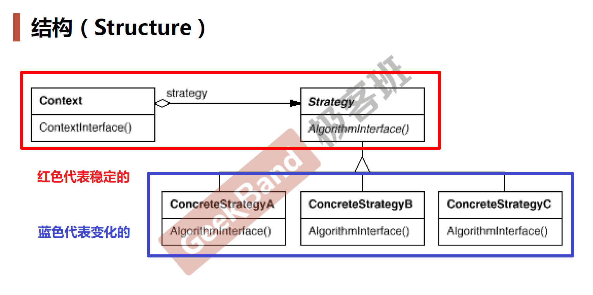
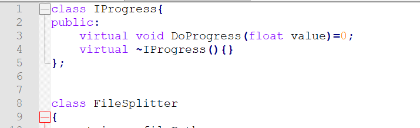
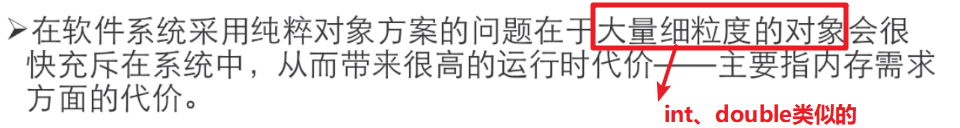
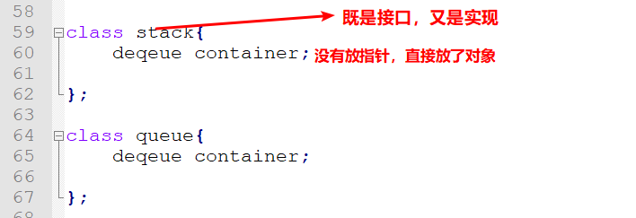

# C++设计模式

> “每一个模式描述了一个在我们周围不断重复发生的问题，以及该问题的解决方案的核心。这样，你就能一次又一次地使用该方案而不必做重复劳动”

之前学习的课程主要是C++的底层思维（面向对象的机制）；接下来是向上的抽象思维


设计模式的目标：复用

## 23 个设计模式的分类


- 引出设计模式的方法：「重构获得模式 Refactoring to patterns」

- 「重构」关键技法：

  


## Template Method 模板方法

观察下面两种实现：


其中，方式1 采取了如下的设计流程：

这是一种结构话的 设计思维（说明有时候虽然用的是面向对象的设计语言，但你的设计思维有可能是结构化的）


而方式2将程序的主流程放到了类库的开发过程中，将步骤2、4设计为纯虚函数，如下图所示：

这是一种面向对象的设计思维


这样，引出了`早绑定`与`晚绑定`


`早绑定`：指的是晚开发的应用程序会去调用早开发的类库里面的函数

`晚绑定`：指的是早开发的类库会去调用晚开发的应用程序里面的 override 的虚函数（反向的控制结构，（站在类库的角度，也就是）不要调用我，让我来调用你）

> 早绑定 -> 晚绑定


## Strategy 策略模式

> 真正的「复用」是编译单位的复用性，而不是源代码级别复制粘贴的复用性


`策略模式定义`：


`上述的模式的抽象结构如下图所示`



`总结`

1. **Strategy模式提供了用条件判断语句（结构化时代分而治之的思路）以外的另一种选择，消除条件判断语句，就是在解耦合。含有许多条件判断语句的代码通常都需要Strategy模式**

   `也就是说：代码中一旦出现条件判断语句，一般来说就是需要策略模式的特征`

2. 同时，过多的if-else语句如果不被执行到，装载到代码块中也是一种负担

   


## Observer/Event 观察者模式

`观察者模式的动机`：从 一个 不良的耦合 -> 一个 良好的耦合

```swift
	在软件构建过程中，我们需要为某些对象建立一种“通知依赖关系” ——一个对象（目标对象）的状态发生改变，所有的依赖对象（观察者对象）都将得到通知。如果这样的依赖关系过于紧密，将使软件不能很好地抵御变化。(所以提倡松耦合)
```

`观察者模式定义`


`上述的模式的抽象结构如下图所示`


### Show code

`设计场景`：假如需要设计一个文件分割器，其中 MainForm 是界面	


上述设计的进度条 ProgressBar 是一种紧耦合，违背了“高层模块不能依赖于低层模块，二者都应该依赖于抽象”；更好的设计有观察者的代码如下图所示：





`接口在C++中其实就是抽象基类`


## Decorator 装饰模式

- 单一职责 模式

 `设计模式的真谛在于：编译时让他们复用，运行时让他们不一样`

`设计模式推荐：组合优于继承`

由于对继承的不良使用，造成代码的大量冗余

`观察者模式的动机`：


上述所谓静态特质如下图代码所示：


`装饰模式内涵`：往功能上附着【装饰】新功能

`模式定义`：

```swift
动态（组合方式）地给一个对象增加一些额外的职责。就增加功能而言，Decorator模式比生成子类（继承方式）更为灵活（消除重复代码 & 减少子类个数）
```

`模式结构如下图所示`：


`Decorator模式最重要的一个特征`


也就是说，如果一个类既继承一个类，又组合同一个类，基本上可以断定是Decorator设计模式（正常情况，要么继承，要么组合）


在这里，继承一个Stream类是为了完善接口的规范性


而组合一个Stream类指针是为了实现未来的多态性


`重要理解`


正确的做法如下所示，应用两个方向的组合


## Bridge 桥模式

- 单一职责 模式

`模式结构如下图所示`


`模式设计的动力如下`：


## Factory Method 工厂方法

- 对象创建 模式

```swift
通过“对象创建” 模式绕开 new，来避免对象创建（new）过程中所导致的紧耦合（依赖具体类），从而支持对象创建的稳定。
它是接口抽象之后的第一步工作
在软件系统中，经常面临着创建对象的工作；由于需求的变化，需要创建的对象的具体类型经常变化
```

`注意：在任何的编程语言里，抽象基类或者接口是不能够被创建（new）的`

`工厂方法解决的问题`


`工厂模式逻辑如下`


`模式定义`


`工厂模式的结构图`


`工厂模式的缺点或者限制`  **Factory Method模式解决“单个对象”的需求变化。缺点在于要求创建方法/参数相同**


## Abstract Factory 抽象工厂

- 对象创建 模式

`抽象工厂解决的问题的场景`


抽象工厂和工厂方法的不同就在于上述红框中的“一系列相互依赖的对象”

### 面向接口编程的概念


`模式定义`


`模式结构图`


`要点总结`


`工厂方法模式是抽象工厂模式的一个特列`


## Prototype 原型模式

- 对象创建 模式 

`设计思路`

将工厂方法中的抽象类部分合并，如下图所示：


`模式定义`


如下图所示：


`设计结构如图`


## Builder 构建器

- 对象创建 模式 

 `注意` C++在构造函数中的虚函数是不能去调用子类的虚函数的，例如，下面的例子会报错，因为这个类的虚函数没有被实现，又不能去调用子类的虚函数


`模式定义`


## Singleton 单件模式

- 对象性能 模式

`设计动力`


上述的关键在于：如何绕过常规的构造器，提供一种机制来保证一个类只有一个实例；且这应该是`类设计者的责任`，而非类使用者的责任

`设计的关键`

1. 将类的**构造函数**和**拷贝构造函数**设计成**private**的（目的是为了让外界不能使用他们）
2. 设计静态的成员函数和静态的变量


`模式的结构图`


## Flyweight 享元模式

- 对象性能 模式

`设计动力`



`模式定义`


`模式结构`


`代码示例`


`小结`


## Façade 门面模式

- 接口隔离 模式


`设计原型`


`模式定义`


`没有固定的代码结构，表达的是一种子系统内部和外部的解耦关系`


## Proxy 代理模式

- 接口隔离 模式

通常来说，我们组合式的调用接口的函数，通常会这样做


采用了Proxy代理后的代码如下图所示：


`小结`


## Adapter 适配器

- 接口隔离 模式

`设计动力`


`模式定义`


`模式结构图`


`代码实现`


其使用如下：


例如：STL 中的 stack 和 queue 中就利用了这种设计模式




## Mediator 中介者

- 接口隔离 模式

`模式定义`


`小结`

**Facade模式是解耦系统间的对象关联关系；而中介者模式是解耦系统内的对象关联关系**


## State 状态模式

- 状态变化 模式

`设计动力`


`代码场景`

假设存在如下代码，根据不同的状态其行为也不同：


其实，这和之前的 Strategy 策略模式非常类似，就是有许多的 if-else，当增加一个状态时，可维护性会非常差；违背了开闭原则。

好得设计如下所示：


`优势`：当状态增加的时候，只需要加一个状态类，而不需要改变 NetworkProcessor 类

`模式定义`


`模式结构`


和策略模式非常像


## Memento 备忘录

- 状态变化 模式

  `设计动力`


​	                                                                                                                                                                                                                                                                                                                                                                                                                                                                                                  

`代码示例`


`小结`


## Composite 组合模式

- 数据结构 模式

`模式定义`


`代码示例`


`模式结构`


## Iterator 迭代器

- 数据结构 模式


`模式定义`


`模式结构`


## Chain of Resposibility 职责链

- 数据结构 模式

`设计动机`


