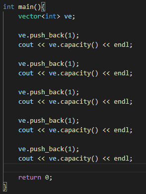
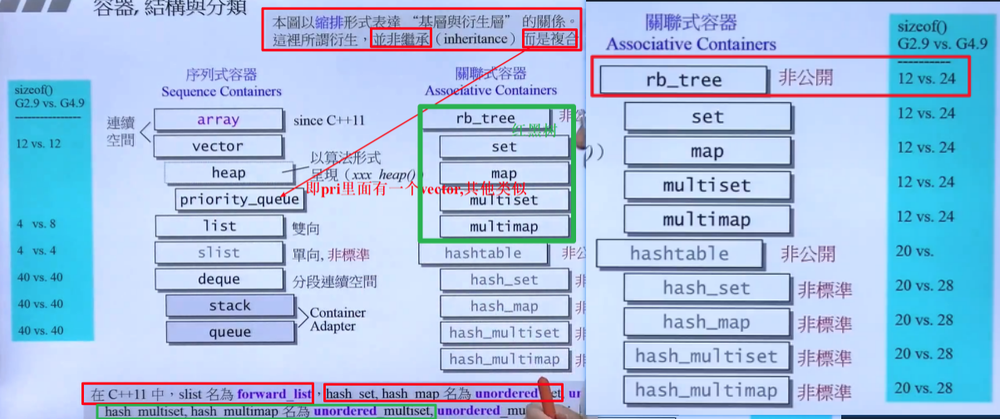
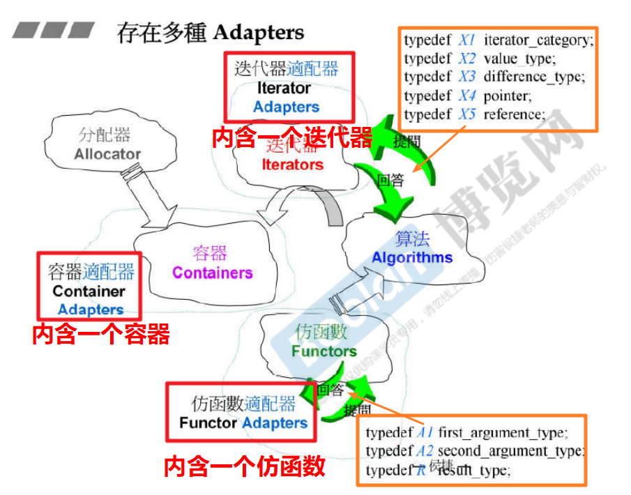

# STL标准库体系结构与内核分析

## 前言

**所谓 Generic Programming （GP，泛型编程）就是使用 template 模板为主要工具来编写程序。而STL正是泛型编程最成功的作品**

STL源码存放位置：C:\mingw64\lib\gcc\x86_64-w64-mingw32\8.1.0\include\c++\bits

## OOP vs. GP

OOP（Object-Oriented Programming）: OOP将数据和算法关联起来

GP（generic Programming）：将数据和算法分开来

- 优势：Container和Algorithm开发可以分开来，通过迭代器沟通；算法通过迭代器确定范围，并通过迭代器取用元素

  

## 目标

- 使用C++标准库
- 认识C++标准库
- 良好使用C++标准库
- 扩充C++标准库

## STL六大部件

- 容器 Container     各种数据结构，如 vector, list, deque, set, map 等，用来存放数据，从实现的角度来看，STL 是一种 class template。


- 分配器 Allocator   负责空间配置与管理。从实现的角度来讲，配置器是一个实现了动态空间配置、空间管理、空间释放的 class template （可省略）
- 算法 Algorithm      常用算法如 sort, search, copy, erase 等，从实现的角度来看，STL算法是一种 function template
- 迭代器 Iterator
- 适配器 Adapter    一种用来修饰容器或仿函数或迭代器接口的东西。
- 仿函数 Functor   行为类似函数，可作为算法的某种策略。从实现的角度看，仿函数是一种重载了operator()的class或class template，一般函数指针可视为狭义的仿函数。


## 关于 「左闭右开」区间

**标准库使用的是：begin() 表示第一个元素；end()表示最后一个元素的后一个元素**


## STL-1 容器的分类

### 顺序容器

- array 

- vector

- list

- forward_list[==slist]

- deque

### 关联容器（查找快）

`**有序容器（内部基于 红黑树 实现、数学地）*`


#### 有序

- multiset 

- multimap

- set

- map

#### 无序

`（内部基于 HashTable 实现，经验地）`

C++ 11 之后无序容器的名称发生的变化如下图所示


- unordered_multiset

- unordered_multimap

- unordered_set

- unordered_map

### 容器适配器

> 由于 stack 和 queue 中实际上没有自己的数据结构，所以不把他们叫做容器，而是叫做  `容器适配器` （也有人就叫容器）

- stack

- queue


## 容器的详细介绍

### 1 array 

- 无法扩充大小，因此其使用时必须指定大小，如下图所示：

  

#### 迭代器


- 参考[vector](# vector 的迭代器)


### 2 vector

`注意` vector中分配的空间的大小是 `*2 增长`的，如下图所示：




`并且十分需要注意的是` ：vector的成长两倍的过程是比较缓慢的，这是因为不可能直接成长2倍，而是必须要找到另外一块2倍大小的空间，然后将原来位置的元素一个个搬过去；因此其每次的成长都会大量的调用 **拷贝构造函数** 和 **析构函数**

#### vector 类的大小


由于只要这`三个指针`就可以完全确定一个 vector，所以其大小为 $4 字节 * 3 = 12 字节$（参见[蓝色方框](# 容器之间的关系)）

```C++
template <class T, class Alloc = alloc>
class vector {
...
protected:
    iterator start;          // 表示目前使用空间的头
    iterator finish;         // 表示目前使用空间的尾，即最后一个元素的下一个元素
    iterator end_of_storage; // 表示目前分配的整个空间的尾
    ...
};
```

#### vector 的迭代器


`注` 由于vector的存储空间是连续的，因此其迭代器不用设计成一个class，可以直接使用一个指针来代替，如上图所示，因此萃取机会偏特化成 T* 类型的版本。


### 3 list（双向链表） /  forward_list（单向链表）[==slist]

- list 的继承图：

  

- list和forward_list的主要区别在于：forward_list是传统数据结构意义中的单链表，而list是双链表


`注意` 

```swift
sort() 函数模板定义在头文件 algorithm 中，要求使用随机访问迭代器。但 list 容器并不提供随机访问迭代器，只提供双向迭代器，因此不能对 list 中的元素使用 sort() 算法。但是，还是可以进行元素排序，因为 list 模板定义了自己的 sort() 函数。

也就是说：标准库定义的 sort() 函数在 list 排序中无法使用，16 行的代码是错误的，15 行是正确的
```

#### list 类 的大小

 `注意` 要注意区分 `list 本身的大小` 和 `List 类的节点的大小`

如下图所示是 STL 中 list 类的定义：


其中数据部分只包含一个 list_node*  的指针，所以，其在32 位机上 所占用的内存为 4 字节（参见[蓝色方框](# 容器之间的关系)）

而每个节点的大小：


是由 2个 指针和一个 T类型的模板数据所构成的。

- 补充：

  

#### 迭代器 iterator


### 4 deque

- `分段连续` ： `连续是假象，分段是事实`，迭代器走到分段的边界时，要跳到下一个分段的首

- 模型：

  

- 具体做法： 依赖 buffer 和 指针 连接起来，`每次扩充一个 buffer` ，如下图所示：

  

- 注意：几乎每个容器都提供了 begin() 和 end() 这两个迭代器，所以上图也画出了 start 和 finish

- > iterator 中的 node 是指针的指针，其余是指针？求证

#### deque 类的大小


所以其大小为 ：$16 * 2 + 4 + 4 = 40 字节$

其中，迭代器的大小如下图所示：


`至于他内部放多少个元素是动态分配获得的，跟这个对象本身没有关系`


#### 以 deque<T>::insert() 为例谈deque的妙处

由于：每次调用 insert() 插入新数据的时候，都需要调用构造函数将元素向前或者向后推动，以空出一个位置让新数据填入，因此，如果元素比较靠近前端就应该将前面的元素向前推动；否则就应该将后端的元素向后推动：


#### deque如何模拟连续空间

`答案 ： 全部都是 deque iterator 的功劳`

`迭代器 de 操作符重载`

如下图所示：一定是对 $-$ 号做了操作符重载，因为计算 $size$ 大小 其实就是要计算 「在 start 到 finish 之间有多少个元素」也就是 ：

```swift
在 start 到 finish 之间的buffer 个数 * 每个buffer 的大小 + start这个 buffer 中的元素 + finish所指向的buffer 的元素个数
```


源码实现如下：


### 5 stack

- 源码里面有一个 deque，也就是不需要重新写一个类， ，这样就形成一个新的容器，如下图所示：

  

- stack  和 queue 都不允许遍历，也不提供迭代器：

  

- stack 和 queue 都可以选择 list 或者 deque 作为 **「底层结构」**，默认是 deque，要改的话如下图所示：

  

- 另外，stack还可以使用 vector 作为**「底层结构」**
- `结论`：如果要作为**「底层结构」**，需要转调用的函数底层结构都有

### 6 queue

- 源码里面有一个 deque，也就是不需要重新写一个类， ，这样就形成一个新的容器，如下图所示：


- queue不可以使用 vector 作为**「底层结构」**，这是因为 vector 不提供 pop_front() 成员函数，如下图所示：

  


### 7 multiset 

- set 的 value 就是 key ，key 就是 value

- 标准库有一个 find [::find(c.begin(), c.end(), target)]，容器自身有一个 find [c.find(target)]，容器自带的 find 查找速度会更快，如下所示：

  


- set/multiset 是以 rb_tree 为底层结构，因此有 「元素自动排序」的特性，排序的依据是 key
- `**无法**`使用红黑树的迭代器的 iterator改变元素值（会打破排序的状态），具体技术实现见[图片](# 标准库的实现)
- multiset 元素的 key 可以重复，因此其 insert() 用的是 rb_tree 的 insert_equal()


#### 标准库的实现


### 8 multimap

- 要使用 $pair<int, string>(i, buf)$​ 类似的结构插入数据
- 特别 注意： multimap 不可以使用 [] 做数据的插入，只能使用上面的方式，参见 map

### 9 set

### 10 map

- 可以使用 [] 做数据的插入，例如：

  

  会自动组合成一个 pair


### 11 unordered_multiset

其概括地形象的结构图如下所示：


实际上其内部的实现是 由一个个的 bucket 串联起来的，每个bucket 上又挂了不同个数的 元素，如下图所示：


测试如下所示：


所以说，bucket 的个数 比元素的数量还多也是正常的，因为有些 bucket 是空的（事实上，bucket 一定比元素多 ）

### 12 unordered_multimap

### 13 unordered_set

### 14 unordered_map


### 更多的一些容器

#### priority_queue


## 哈希表 (Hash Table 散列表)

- `哈希表更多的是根据经验的设计`
- `bucket 个数 一定大于 元素的个数，否则就要 rehashing 扩充`

其实现过程如下所示：


### 哈希表的直接使用


`注` strcmp() 函数的声明如下图所示：


## STL-5 迭代器的设计原则和Iterator Trait的作用与设计

- trait 本身的意思是：特征
- 萃取

### Iterator 需要遵循的原则


**上面图中的 5 种typedefine 就是迭代器给出的回答**

### 问题的关键

但：如果 iterator 并不是一个 class ，例如 `native pointer` (普通的指针被视为一种退化的迭代器)

这样的话，算法问的问题，指针是无法回答的，因为根本就不存在类的定义

这时候就需要 trait


### trait 的做法

`不直接问` 直接问是如下这样的：


此时，我们先不直接问，间接问：


完整的5个问题的版本如下：


### 各式各样的 Traits


## 容器之间的关系



`a要用b的功能，a可以继承b，或者拥有b，STL 中用的是复合（拥有）`

左边蓝色的方框中标注的是在 32位机 上，在不同版本下容器本身所占的字节大小


## STL- 3 分配器 Allocator

分配器的实现流程如下图所示：


> GCC 2.9 的 `allocator类` 只是以 ::operator new 和 ::operator delete 完成 allocate() 和 deallocate() ，没有任何特殊设计；但是在调用 malloc 的时候，会有许多的 overhead 也就是头尾的额外开销，而且这种简单的封装只会减缓运行速度，因此，GNU 2.9 并没有使用这个类，其默认的调用的分配器是 `alloc 类`，其行为模式如下图所示：


思路是，由于容器的大小是固定的，因此可以省去上下的 cookie ：


## STL-2 标准库提供的算法

### 算法举例

#### find() 

- 顺序查找

#### _if

`一般算法中出现 if 条件说明会有一个仿函数的模板参数`


#### sort算法


## 关于 reverse_iterator

**这里需要注意，指针指向（黑色箭头） 和 指针指向的内容（绿色箭头） 的区别**


## STL - 4 仿函数 Functors

- 最容易融入标准库，服务于算法

- 加就加，减就减，为什么要把这些动作设计成一个函数呢，这些因为要把这些动作传到算法里面去


### 举例 重要 


`注意` 标准库中的仿函数都继承了 binary_function(两个操作数)，（实际上还可以继承自 unary_function），只有继承了这两个类之一，才可以融入「STL体系」

如下所示：


这种继承叫做：`仿函数可适配(adaptable)的条件`


## STL-6 适配器 

- 实际上叫做 改造器 的话还挺好的


### 概述

如果a要改造b的功能，那么也就是要在幕后调用b，有两种方式 a继承自b 或者 a 复合（内含）一个b；在STL中，统统采用后者的方式；如上图所示总结为下图



#### 最简单的-容器的适配器 adapter


`改造了函数的接口，开放部分底层的函数，改变名字等`

#### 函数的适配器 


#### 迭代器adapter适配器

关键是 来修饰、改造原来的正向的adapter，如下图所示：


#### X适配器

##### ostream_iterator


##### istream_iterator


## 一个万用的Hash Function

- 基本想法：一些基本的元素已经有他们的Hash Function，例如整数、字符串等；是否可以将一个复杂的结构拆分成一些简单的部分，然后将他们的Hash Code相加

  

  问题：单纯的相加可以存在很多碰撞，所以更好的方式已经被设计，如下所示： 

  

### Hash Function 实现的 3 种方法/形式


或者，去实现类似标准库中偏特化版本：


## Tuple 元组

### 使用方法


### 实现tuple的重要技术——自动递归


