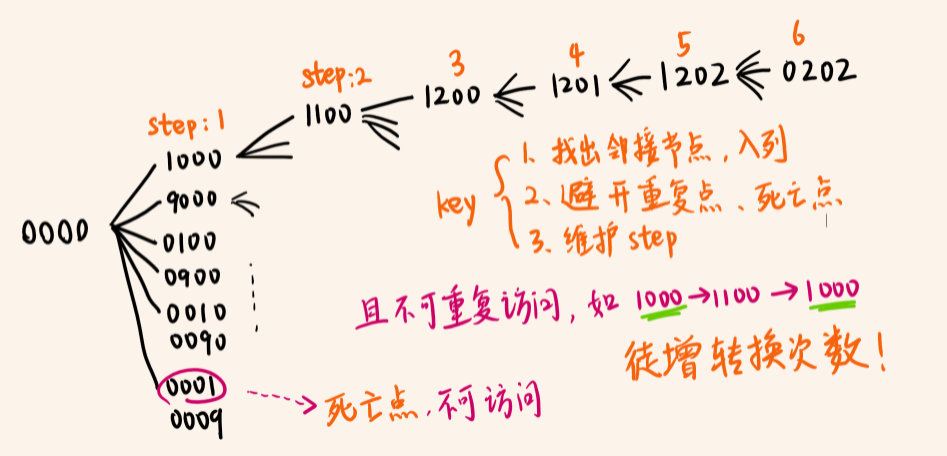
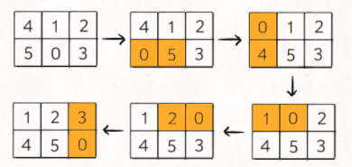
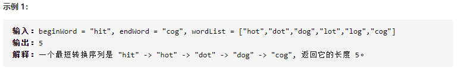
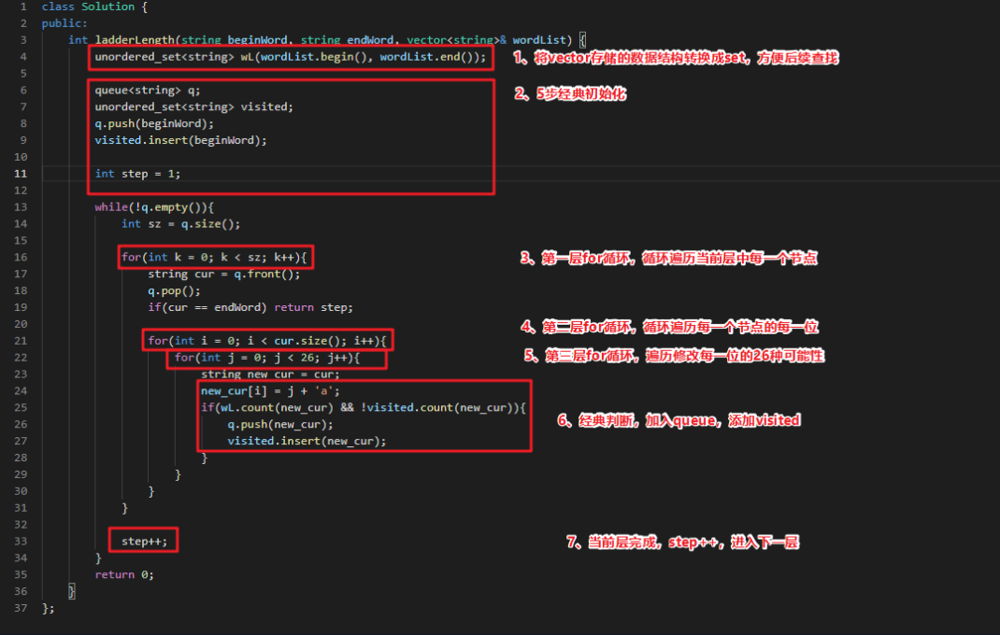

# 										BFS算法

## 适用情形

寻找最短路径

## BFS术语

- start ：起点
- target ：终点

## 算法框架

```C++
// 计算从起点 start 到终点 target 的最近距离
    queue<Node> q; // 核心数据结构
    set<Node> visited; // 避免走回头路
    
    q.push(start); // 将起点加入队列
    visited.insert(start);

    int step = 0; // 记录扩散的步数

    while(!q.empty()) {
        int sz = q.size();
        
        /* 将当前队列中的所有节点向四周扩散 */
        for (int i = 0; i < sz; i++) {
            Node cur = q.front();
            q.pop();
            /* 划重点：这里判断是否到达终点 */
            if (cur == target)
                return step;
            
            /* 将 cur 的相邻节点加入队列 */
            for (Node x : cur.adj()){
                if (!visited.count(x)) {
                    q.push(x);
                    visited.insert(x);
                }
            }

        }
        /* 划重点：更新步数在这里 */
        step++;
    }
```

## 相关题目

### [752. 打开转盘锁](https://leetcode-cn.com/problems/open-the-lock/)

题目描述：例如生活中正常的4位密码锁，每次旋转1位；计算要避开死亡密码，达到target的最小步数



```C++
class Solution {
public:

    string plusOne(string s, int j){
        if(s[j] == '9') s[j] = '0';
        else
            s[j]++;
        return s;
    }

    string minusOne(string s, int j){
        if(s[j] == '0') s[j] = '9';
        else
            s[j]--;
        return s;
    }

    int openLock(vector<string>& deadends, string target) {
        // 记录需要跳过的死亡密码，使用set实现快速查找
        set<string> deads(deadends.begin(), deadends.end());

        // 记录已经穷举过的密码，防止走回头路
        set<string> visited;

        queue<string> q;
        int step = 0;
        q.push("0000");
        visited.insert("0000");

        while(!q.empty()){
            int sz = q.size();
            /* 将当前队列中的所有节点向周围扩散 */
            for(int i = 0; i < sz; i++){
                string cur = q.front();
                q.pop();

                /* 判断是否遇到死亡密码*/
                if(deads.count(cur)) continue;

                /* 判断是否到达终点*/
                if(cur == target) return step;

                /* 将一个节点的未遍历的相邻节点加入队列 */
                for(int j = 0; j < 4; j++){
                    string up = plusOne(cur, j);
                    if(!visited.count(up)){
                        q.push(up);
                        visited.insert(up);
                    }
                    string down = minusOne(cur, j);
                    if(!visited.count(down)){
                        q.push(down);
                        visited.insert(down);
                    }
                }

            }
            step++;
        }
        return -1;
    }
};
```

`注`

1. ```C++
   set<string> deads(deadends.begin(), deadends.end());
   ```

   set容器的这种赋值初始化方法要记住很方便

### [773. 滑动谜题](https://leetcode-cn.com/problems/sliding-puzzle/)

题目描述：只能用「0」的位置，计算达成target所需的步数



```C++
class Solution {
public:
    int slidingPuzzle(vector<vector<int>>& board) {
        int m = 2, n = 3;
        string start = "";
        string target = "123450";
        
        // 将 2 x 3 的数组转化成字符串
        for(int i = 0; i < m; i++){
            for(int j = 0; j < n; j++){
                start.push_back(board[i][j] + '0'); // 记录写法
            }
        }

        // 记录以为字符串的相邻索引值
        vector<vector<int>> neighbor = {
            {1, 3},
            {0, 4, 2},
            {1, 5},
            {0, 4},
            {3, 1, 5},
            {4, 2}
        };

        /********* BFS 算法框架开始 ********/
        queue<string> q;
        unordered_set<string> visited;
        q.push(start);
        visited.insert(start);
        int step = 0;

        while(!q.empty()){
            int sz = q.size();
            for(int i = 0; i < sz; i++){
                string cur = q.front();
                q.pop();
                if(target == cur){
                    return step;
                }

                // 找到数字「0」所在的索引值
                int index = 0;
                for(; cur[index] != '0'; index++);

                // 将数字「0」和相邻位置的数字交换位置
                for(int adj : neighbor[index]){
                    string new_board = cur;
                    swap(new_board[adj], new_board[index]);
                    // 防止走回头路
                    if(!visited.count(new_board)){
                        q.push(new_board);
                        visited.insert(new_board);
                    }
                }
            }
            step++;
        }

        return -1;
        /********* BFS 算法框架结束 ********/
    }
};
```

`注`

1. ```C++
   start.push_back(board[i][j] + '0'); // 记录写法
   ```

   注意这里int类型转char类型的方法

### [127. 单词接龙](https://leetcode-cn.com/problems/word-ladder/)

题目描述：



```C++
class Solution {
public:
    int ladderLength(string beginWord, string endWord, vector<string>& wordList) {
        unordered_set<string> wL(wordList.begin(), wordList.end());

        queue<string> q;
        unordered_set<string> visited;
        q.push(beginWord);
        visited.insert(beginWord);

        int step = 1;

        while(!q.empty()){
            int sz = q.size();

            for(int k = 0; k < sz; k++){
                string cur = q.front();
                q.pop();
                if(cur == endWord) return step;

                for(int i = 0; i < cur.size(); i++){
                    for(int j = 0; j < 26; j++){
                        string new_cur = cur;
                        new_cur[i] = j + 'a';
                        if(wL.count(new_cur) && !visited.count(new_cur)){
                            q.push(new_cur);
                            visited.insert(new_cur);
                        }
                    }
                }
            }
            
            step++;
        }
        return 0;
    }
};
```

`注`




## 小结

1. BFS算法通常不需要像DFS回溯算法那样专门写一个backtrack()函数，因为BFS不存在递归，直接写在主函数内部即可

