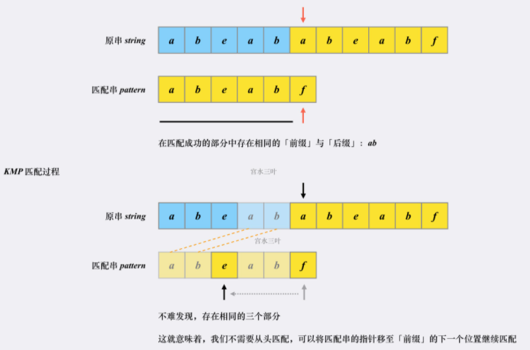
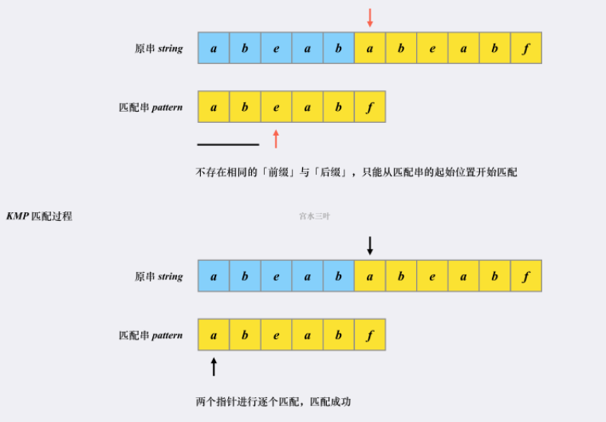
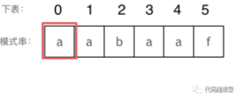
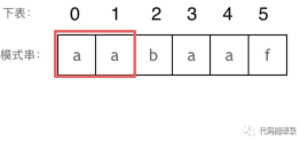
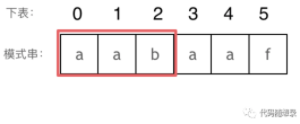
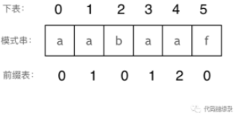
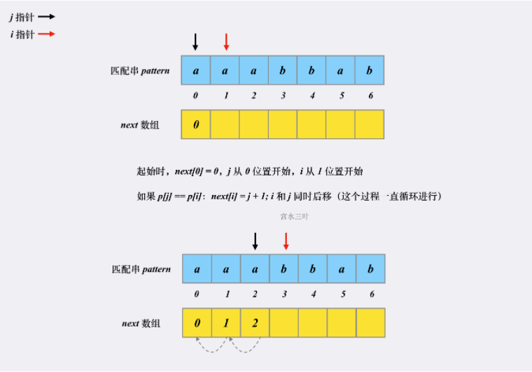
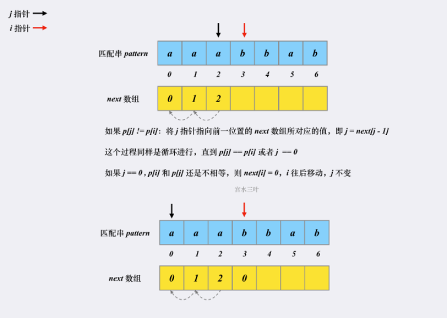
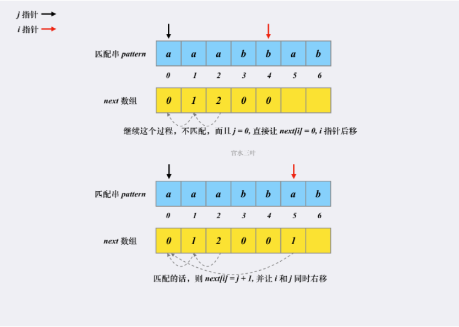
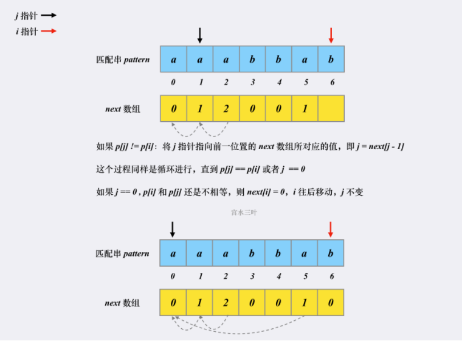

# 								KMP算法

## 概念

- KMP 算法是一个快速查找匹配串的算法，它的作用其实就是[Leetcode 28](https://leetcode-cn.com/problems/implement-strstr/)问题：**如何快速在「原字符串」中找到「匹配字符串」**

- 暴力搜索不考虑剪枝的话复杂度是 O(m * n) 的，而 **KMP 算法的复杂度为 O(m + n)**

- **KMP 之所以能够在 O(m + n) 复杂度内完成查找，是因为其能在「非完全匹配」的过程中提取到有效信息进行复用，以减少「重复匹配」的消耗**

## 术语

`前缀`：包含首字母，不包含尾字母  对于字符串 abcxxxxefg，我们称 abc 属于 abcxxxxefg 的某个前缀。
`后缀`：包含尾字母，不包含首字母  对于字符串 abcxxxxefg，我们称 efg 属于 abcxxxxefg 的某个后缀。

## 算法步骤

1. 在能匹配上的部分，「朴素匹配」和「KMP」并无不同，两个指针会同时往右移动

2. 遇到匹配不上的部分，**首先匹配串会检查之前已经匹配成功的部分中里是否存在相同的「前缀」和「后缀」。如果存在，则跳转到「前缀」的下一个位置继续往下匹配：**

   

3. **跳转到下一匹配位置后，尝试匹配，发现两个指针的字符对不上，并且此时匹配串指针前面不存在相同的「前缀」和「后缀」，这时候只能回到匹配串的起始位置重新开始：**

   

## next数组的构建

### 理论

表示：**下标i之前（包括i）的字符串中，有多大长度的相同前缀后缀。**

如图：



长度为前1个字符的子串a，最长相同前后缀的长度为0。（注意字符串的前缀是指不包含最后一个字符的所有以第一个字符开头的连续子串；后缀是指不包含第一个字符的所有以最后一个字符结尾的连续子串。）



长度为前2个字符的子串aa，最长相同前后缀的长度为1。



长度为前3个字符的子串aab，最长相同前后缀的长度为0。

以此类推：

长度为前4个字符的子串aaba，最长相同前后缀的长度为1。
长度为前5个字符的子串aabaa，最长相同前后缀的长度为2。
长度为前6个字符的子串aabaaf，最长相同前后缀的长度为0。
那么把求得的最长相同前后缀的长度就是对应前缀表的元素，如图：



### 编码









## 相关题目

### [28. 实现 strStr()](https://leetcode-cn.com/problems/implement-strstr/)

```C++
class Solution {
public:
    int strStr(string s, string p) {
        int n = s.size(), m = p.size();
        if(m == 0) return 0;
        //设置哨兵
        s.insert(s.begin(),' ');
        p.insert(p.begin(),' ');
        vector<int> next(m + 1);
        //预处理next数组
        for(int i = 2, j = 0; i <= m; i++){
            while(j and p[i] != p[j + 1]) j = next[j];
            if(p[i] == p[j + 1]) j++;
            next[i] = j;
        }
        //匹配过程
        for(int i = 1, j = 0; i <= n; i++){
            while(j and s[i] != p[j + 1]) j = next[j];
            if(s[i] == p[j + 1]) j++;
            if(j == m) return i - m;
        }
        return -1;
    }
};
```

`注`

1. 
