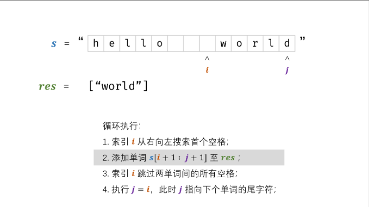

# 双指针法

## 问题类型

- 翻转字符串
- ...

## 相关题目

#### [剑指 Offer 58 - I. 翻转单词顺序](https://leetcode-cn.com/problems/fan-zhuan-dan-ci-shun-xu-lcof/)

题目描述：输入一个英文句子，翻转句子中单词的顺序，但单词内字符的顺序不变。为简单起见，标点符号和普通字母一样处理。例如输入字符串"I am a student. "，则输出"student. a am I"

```C++
class Solution {
public:
    string reverseWords(string s) {
        // 删去字符串前后的空格
        // 设置双指针，从后往前移动
        int i = s.size() - 1;
        int j = s.size() - 1;
        string res;
        
        while(i >= 0){
            // 从右到左寻找到第一个字符,跳过空格
            while(i >= 0 && s[i] == ' ') i--;
            if(i < 0) break;

            // 走完一个单词
            j = i;
            while(j >= 0 && s[j] != ' ') j--;

            // 将每一个分割出来的单词加到结果中
            res += s.substr(j + 1, i - j);
            res += ' ';

            // 继续向前分割单词
            i = j;
        }
        // 去除最后一个单词的多余的空格
        if(!res.empty()) res.pop_back();

        return res;
    }
};
```

`注`

1. 思路：

	- 倒序遍历字符串 $s$ ，记录单词左右索引边界 $i$ ,$j$ ；

	- 每确定一个单词的边界，则将其添加至单词列表 $res$ ；
	- 最终，将单词列表拼接为字符串，并返回即可。

