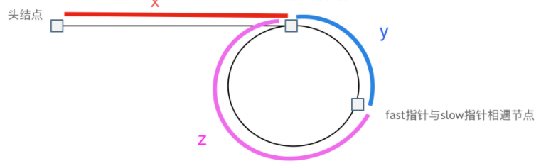

# 								处理链表类题目

## 题目类型

- 单链表
- 双链表、循环链表

## 相关题目

### 单向链表

#### 剑指offer [**JZ3** **从尾到头打印链表**](https://www.nowcoder.com/practice/d0267f7f55b3412ba93bd35cfa8e8035?tpId=13&&tqId=11156&rp=1&ru=/ta/coding-interviews&qru=/ta/coding-interviews/question-ranking)

题目描述：输入一个链表的头节点，按链表从尾到头的顺序返回每个节点的值（用数组返回）

`思路一` 利用栈「先进后出」的性质

```C++
class Solution {
public:
    vector<int> printListFromTailToHead(ListNode* head) {
        // 思路2 利用栈
        stack<int> stk;
        vector<int> res;
        while(head != NULL){
            stk.push(head->val);
            head = head->next;
        }
        
        while(!stk.empty()){
            res.push_back(stk.top());
            stk.pop();
        }
        
        return res;
    }
};
```

`思路二` 利用递归本质上就是一个栈结构

```C++
class Solution {
public:
    vector<int> res;
     
    vector<int> printListFromTailToHead(ListNode* head) {
        // 思路1 递归
        if(head != NULL){ // 这里不需要 && head->next != NULL 这个条件
            printListFromTailToHead(head->next);
            res.push_back(head->val);
        }
         
        return res;
    }
};
```

#### [剑指 Offer 18. 删除链表的节点](https://leetcode-cn.com/problems/shan-chu-lian-biao-de-jie-dian-lcof/)

题目描述：给定单向链表的头指针和一个要删除的节点的值，定义一个函数删除该节点

> Leetcode改动：将给定的要删除节点的指针 换成了 要删除节点的值，原题还强调要求时间复杂度为$O(1)$

```C++
class Solution {
public:
    ListNode* deleteNode(ListNode* head, int val) {
        // 设置 哑节点
        ListNode* dummy = new ListNode(-1, head);
        ListNode* cur = dummy;

        while(cur->next){
            if(cur->next->val == val){
                cur->next = cur->next->next;
                break;
            }
            cur = cur->next;
        }
        
		//返回内容为操作完成之后的链表，该链表不包括哑结点
        return dummy->next;
    }
};
```

`注` 

1.  一般来说，在删除节点的过程中，如果链表头结点head也可能被删除的话，为了方便，我们就得人为定义一个head结点的前一个节点，也就是`虚拟头结点dummy`，这样链表中所有的结点均可**一视同仁**，进行相同的操作。

2. 补充一份按照剑指Offer原书中题目的意思进行的代码

   ```C++
   class Solution {
   public:
       ListNode* deleteNode(ListNode* head, ListNode* deleteNode) {
           if(head==nullptr||deleteNode==nullptr) return nullptr;
   
           // Case-1 删除的节点不是尾节点
           if(deleteNode->next!=nullptr){
               ListNode* nextNode=deleteNode->next;
               deleteNode->val=nextNode->val;
               deleteNode->next=nextNode->next;
           }
           // Case-2 只有一个节点,删除头节点（也即尾节点）
           else if(head==deleteNode){
               head=nullptr;
           }
           // Case-3 删除的节点是尾节点
           else{
               ListNode* p=head;
               while(p->next!=nullptr&&p->next->next!=nullptr){
                   p=p->next;
               }
               p->next=nullptr;
           }
           return head;
       }
   };
   ```

   `注`

   1. 时间复杂度分析：

      - 「Case-1、Case-2」 对于 $n - 1$ 个非尾节点而言，我们可以在 $O(1)$时间内把下一个节点的内容那个复制覆盖要删除的节点，并删除下一个节点
      - 「Case-3」 对于尾节点而言，由于仍然需要顺序查找，时间复杂度是 $O(n)$

      综上，总的平均时间复杂度为 $[(n - 1) * O(1) + O(n)] / n$，结果还是 $O(1)$

#### [83. 删除排序链表中的重复元素](https://leetcode-cn.com/problems/remove-duplicates-from-sorted-list/) ★★

题目描述：存在一个按升序排列的链表，给你这个链表的头节点head，请你删除所有重复的元素，使每个元素只出现一次。

`解法一` 使用单指针遍历

```C++
class Solution {
public:
    ListNode* deleteDuplicates(ListNode* head) {
        if(head == NULL || head->next == NULL) return head;
        
        ListNode* cur = head;
        while(cur->next != NULL){
            if(cur->val == cur->next->val){
                //如果当前节点的值和下一个节点的值相同，就把下一个节点值给删除
                cur->next = cur->next->next;
            }
            else{
                cur = cur->next;
            }
        }
        
        return head;
    }
};
```

`解法二` 递归

```C++
class Solution {
public:
    ListNode* deleteDuplicates(ListNode* head) {
        if (!head || !head->next) {
            return head;
        }
        if (head->val != head->next->val) {
            head->next = deleteDuplicates(head->next);
        } else {
            ListNode* move = head->next;
            while (move->next && head->val == move->next->val) {
                move = move->next;
            }
            return deleteDuplicates(move);
        }
        return head;
    }
};
```

`注`

1. 这道题可以画出一个递归的图，便于理解递归的执行过程：

   

   如上图所示，如果递归出口写的是：

   ```C++
   if(head == NULL || head->next == NULL) return head；
   ```

   那么，递归就到上述的链表中只剩下一个元素的时候，就开始往上层return；

   但是，递归出口也可以简写成：

   ```C++
   if(head == NULL) return head；
   ```

   此时，递归就会一直执行到链表中无元素为止，但不建议写成这样

   如上图所示，`每一层return的值，都会用到上一层的结果`，如下面的方框所示：

   

   这一层的返回值，会判断head->val == head->next->val ？可以知道是 $！=$，所以返回head，同时head->next是上一层的结果3

#### [82. 删除排序链表中的重复元素 II](https://leetcode-cn.com/problems/remove-duplicates-from-sorted-list-ii/) ★★

题目描述：存在一个按升序排列的链表，给你这个链表的头节点head，请你删除链表中所有存在数字重复情况的节点，只保留原始链表中**没有重复出现**的数字。

`解法一` 双指针

```C++
class Solution {
public:
    ListNode* deleteDuplicates(ListNode* head) {
        // 设置「哑节点」 因为头节点也可能被删除，所以要设置哑节点使得所有节点地位相同
        ListNode* dummy = new ListNode(-1);
        dummy->next = head;
        
        // 指向当前遍历的节点
        ListNode* cur = head;
        // 指向当前节点的前一个节点
        ListNode* prev = dummy;
        
        while(cur != NULL){
            while(cur->next != NULL && cur->next->val ==  cur->val){
                // 如果有重复的，cur 就一直往下走
                cur = cur->next;
            }
            
            if(prev->next == cur){
                prev = prev->next;
            }
            else{
                prev->next = cur->next;
            }
            cur = cur->next;
        }
        
        return dummy->next;
    }
};
```

`注`

1. 这个代码的关键逻辑在于：

   - 如果没有遇到重复的元素，prev指针始终在cur指针的前一位置；但是如果遇到有重复的元素，由于只有cur往前移动，所以cur和prev指针的距离会大于1；因此可以根据prev->next是否为cur来判断是否有重复的元素出现：

     - 如果没有，那么prev，cur都向前游动一个位置

     - 如果有，那么prev->next就直接指向当前cur的下一个位置（把重复的全部删除），如下图所示：

       

2. 参考链接：https://mp.weixin.qq.com/s/jg4XfDQCMo31tTKgmgKA6w

`解法二` 递归

```C++
class Solution {
public:
    ListNode* deleteDuplicates(ListNode* head) {
        if (!head || !head->next) {
            return head;
        }
        if (head->val != head->next->val) {
            head->next = deleteDuplicates(head->next);
        } else {
            ListNode* move = head->next;
            while (move && head->val == move->val) {
                move = move->next;
            }
            return deleteDuplicates(move);
        }
        return head;
    }
};
```

##### 对比82、83题的递归解法


#### [141. 环形链表 ](https://leetcode-cn.com/problems/linked-list-cycle/)  链表中环的入口节点 ★

题目描述：给定一个链表，返回链表开始入环的第一个节点。 如果链表无环，则返回 NULL

```C++
class Solution {
public:
    ListNode *detectCycle(ListNode *head) {
        ListNode *fast = head, *slow = head;

        while(fast != NULL && fast->next != NULL){
            // 首先判断是否有环，利用快慢指针，若有环，必在环内相遇
            fast = fast->next->next;
            slow = slow->next;
            if(fast == slow){
                // 有环，继续重新设置快慢节点，用来查找环的起点
                fast = head;
                while(fast != slow){
                    fast = fast->next;
                    slow = slow->next;
                }
                return slow;
            }
        }
        return NULL;
    }
};
```

`注`

1. 本题需要考虑以下几个点，编程并不难，主要是思路问题

   1： **fast指针一定先进入环中，如果fast 指针和slow指针相遇的话，一定是在环中相遇，这是毋庸置疑的。**

   2：如果有环，如何找到这个环的入口
   
   

```swift
那么相遇时：
slow指针走过的节点数为: x + y
fast指针走过的节点数：  x + y + n*(y + z)，n为fast指针在环内走了n圈才遇到slow指针，（y+z）为一圈内节点的个数
因为fast指针是一步走两个节点，slow指针一步走一个节点， 所以 fast 指针走过的节点数 = slow 指针走过的节点数 * 2 
(x + y) * 2 = x + y + n (y + z)
两边消掉一个（x+y） 
x + y = n (y + z)
因为我们要找环形的入口，那么要求的是x，因为x表示 头结点到 环形入口节点的的距离。
所以我们要求x ，将x单独放在左面：
x = n (y + z) - y
在从 n(y+z) 中提出一个（y+z）来，整理公式之后为如下公式：
x = (n - 1) (y + z) + z 
注意这里n一定是大于等于1的，因为 fast指针至少要多走一圈才能相遇slow指针
这个公式说明什么呢，先拿n为1的情况来举例，意味着fast指针在环形里转了一圈之后，就遇到了 slow指针了。
当 n为1的时候，公式就化解为 $x = z$ 这就意味着，从头结点出发一个指针，从相遇节点 也出发一个指针，这两个指针每次只走一个节点， 那么当这两个指针相遇的时候就是 环形入口的节点
```


#### [剑指 Offer 24. 反转链表](https://leetcode-cn.com/problems/fan-zhuan-lian-biao-lcof/)

题目描述：定义一个函数，输入一个链表的头节点，反转该链表并输出反转后链表的头节点

`法一 递归`

```C++
class Solution {
public:
    ListNode* reverseList(ListNode* head) {
        // 递归结束条件
        if(head == NULL || head->next == NULL) return head;

        ListNode* newHead = reverseList(head->next);
        
        // 下面这行错误，应当写成下下行的样子，因为这里是后序遍历的位置，递归到最深层逐个出栈，所以应该拿与入参相关的量做文章
        //newHead->next = head;
        head->next->next = head;
        
        head->next = NULL;

        return newHead;
    }
};
```

#### [剑指 Offer 25. 合并两个排序的链表](https://leetcode-cn.com/problems/he-bing-liang-ge-pai-xu-de-lian-biao-lcof/)

题目描述：输入两个递增排序的链表，合并这两个链表并使新链表中的节点仍然是递增排序的。

```C++
class Solution {
public:
    ListNode* mergeTwoLists(ListNode* l1, ListNode* l2) {
        if(l1 == NULL) return l2;
        else if(l2 == NULL) return l1;

        if(l1->val < l2->val){
            l1->next = mergeTwoLists(l1->next, l2);
            return l1;
        }
        else{
            l2->next = mergeTwoLists(l1, l2->next);
            return l2;
        }
    }
};
```

`注` 

1. 要注意：要将从下级函数获得的返回值，连接到当前节点的尾部

#### [剑指 Offer 35. 复杂链表的复制](https://leetcode-cn.com/problems/fu-za-lian-biao-de-fu-zhi-lcof/)

题目描述：请实现 $copyRandomList$ 函数，复制一个复杂链表。在复杂链表中，每个节点除了有一个 $next$​ 指针指向下一个节点，还有一个 $random$ 指针指向链表中的任意节点或者 $null$。

`本题的题目详细解释说明参考`：https://leetcode-cn.com/problems/copy-list-with-random-pointer/

- 复制示例图：


`思路一` 

```swift
整体思路：
    1. 首先可能会想到双指针边遍历边复制这种方式, 但是此方式只适合普通链表的复制
        由于本题中存在 random 属性，其指向的结点是随机的，因此双指针这种方式不行（因为链表查找元素只能一个一个遍历查找）
		所以其时间复杂度为 O(N^2)
    2. 那么问题在于，怎么使其变成可以支持快速访问呢？ --> 使用哈希表， 存储每个结点复制后的新结点；
    3. 在得到新结点与旧结点的映射关系后，怎么进行复制呢？
    4. 问题转化为 通过某种方式 将新结点按照旧结点的关系进行连线
        由于要参照旧结点的关系 ---> 一定需要遍历原始链表
    5. 连线方式：遍历到原始链表的当前结点cur, 从 map 中取出 cur 结点映射的结点 newCur, 
        我们需要做的就是 将newCur 按照 cur 在原始链表中的关系连线, 
        因为是要对 新结点 进行连线， 因此所有的结点都必须 从 map 中取对应的新结点
        newCur.next 对应的 next 在map中的映射为 map.get(cur.next);
        newCur.random 对应的 random 在 map中映射为 map.get(cur.random); 
    6. 返回头结点, 新链表的头结点也存储在 map中， 因此需要返回 map.get(head);!!!!  
```

```C++
class Solution {
public:
    Node* copyRandomList(Node* head) {
        if(head == NULL) return NULL;
        // 建立用来遍历 原链表 的指针
        Node* cur = head;
        // 哈希表 建立 “旧-新” 节点之间的对应关系
        unordered_map<Node*, Node*> um;

        // 复制各节点，并建立 “原节点 -> 新节点” 的 Map 映射
        while(cur != NULL){
            // new 用来 进行 ==> 深拷贝
            um[cur] = new Node(cur->val);
            cur = cur->next;
        }

        // 复制好节点后，遍历赋值每个节点的两个指针
        cur = head;
        while(cur != NULL){
            um[cur]->next = um[cur->next];
            um[cur]->random = um[cur->random];
            cur = cur->next;
        }

        return um[head];
    }
};
```

`注` 

1. 空间复杂度 $O(N)$，时间复杂度 $O(N)$​


#### [剑指 Offer 52. 两个链表的第一个公共节点](https://leetcode-cn.com/problems/liang-ge-lian-biao-de-di-yi-ge-gong-gong-jie-dian-lcof/)

题目描述：输入两个链表，找出它们的第一个公共节点

```C++
class Solution {
public:
    ListNode *getIntersectionNode(ListNode *headA, ListNode *headB) {
        ListNode* ptr1 = headA, *ptr2 = headB;

        if(headB == NULL || headA == NULL) return NULL;

        while(ptr1 != ptr2){
            if(ptr1 == NULL) ptr1 = headB;
            else if(ptr1 != NULL) ptr1 = ptr1->next;
            if(ptr2 == NULL) ptr2 = headA;
            else if(ptr2 != NULL) ptr2 = ptr2->next;            
        }

        return ptr1;
    }
};
```

`注`

1. 思路：我们使用两个指针 node1，node2 分别指向两个链表 headA，headB 的头结点，然后同时分别逐结点遍历，当 node1 到达链表 headA 的末尾时，重新定位到链表 headB 的头结点；当 node2 到达链表 headB 的末尾时，重新定位到链表 headA 的头结点。

   这样，当它们相遇时，所指向的结点就是第一个公共结点。

    我的理解： 两个链表长度分别为L1+C、L2+C， C为公共部分的长度，按照楼主的做法： 第一个人走了L1+C步后，回到第二个人起点走L2步；第2个人走了L2+C步后，回到第一个人起点走L1步。 当两个人走的步数都为L1+L2+C时就两个家伙就相爱了

这不是《你的名字》的剧情么？

```swift
你变成我，走过我走过的路。
我变成你，走过你走过的路。
然后我们便相遇了..
```


### 双向链表、环形链表

#### [剑指 Offer 36. 二叉搜索树与双向链表](https://leetcode-cn.com/problems/er-cha-sou-suo-shu-yu-shuang-xiang-lian-biao-lcof/)

题目描述：输入一棵`二叉搜索树`，将该二叉搜索树转换成一个排序的`循环双向链表`。要求不能创建任何新的节点，只能调整树中节点指针的指向。`

```C++
class Solution {
public:
    // head 最终结果的头节点， pre 当前节点cur 的前一个节点
    Node* head = NULL, *pre = NULL;

    Node* treeToDoublyList(Node* root) {
        if(root == NULL) return NULL;
        dfs(root);
        // 循环，首尾相连
        head->left = pre;
        pre->right = head;

        return head;
    }

    void dfs(Node* cur){
        if(cur == NULL) return;

        dfs(cur->left);
        
        /* 中序遍历 开始 */
        if(pre != NULL){
            pre->right = cur;
        }
        // 说明是根节点
        else{
            head = cur;

        }            
        cur->left = pre;
        pre = cur;
		/* 中序遍历 结束 */
        
        dfs(cur->right);
    }
};
```

`注`

1. 完成 $dfs()$​ ​各步，只是将**二叉树**变成了**双向排序链表**，我们还需要将链表的首尾连接到一起，将其变成**双向循环排序链表**

   ```C++
   // 循环，首尾相连
   head->left = pre;
   pre->right = head;
   ```


