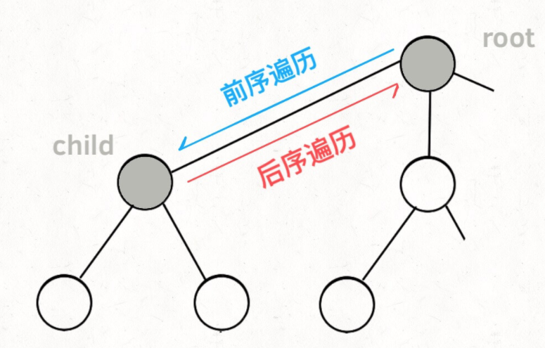
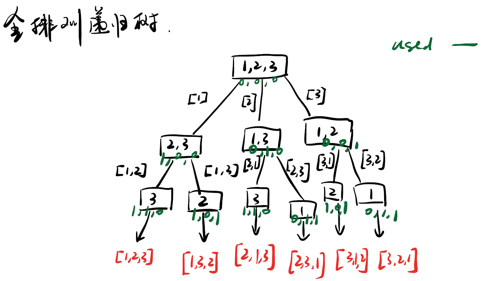
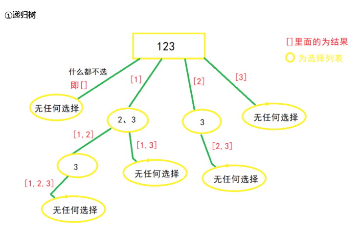
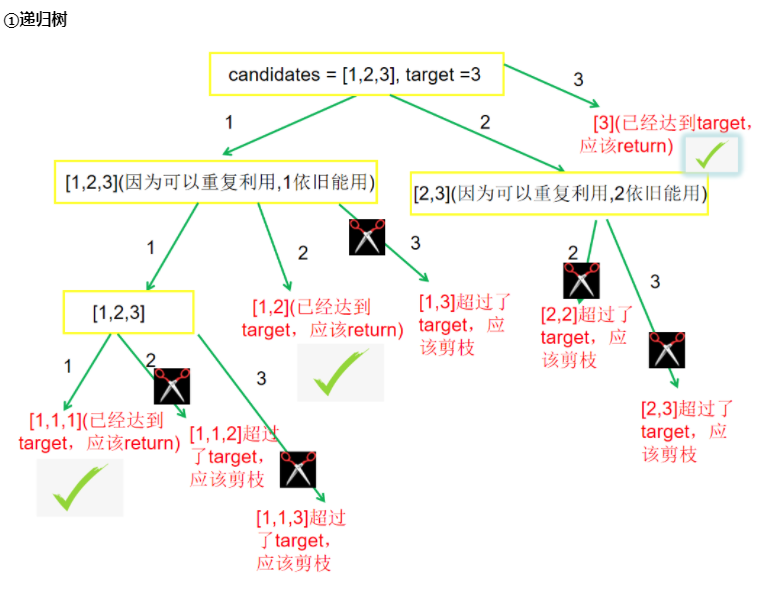
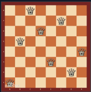
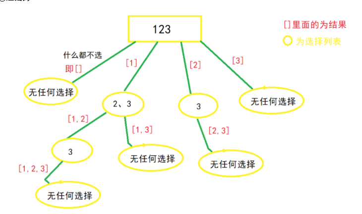
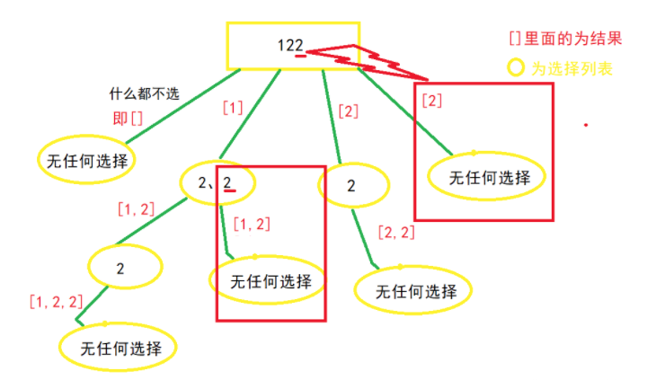
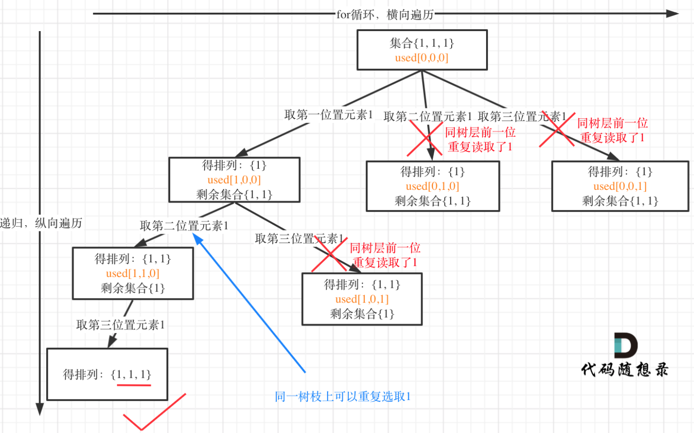
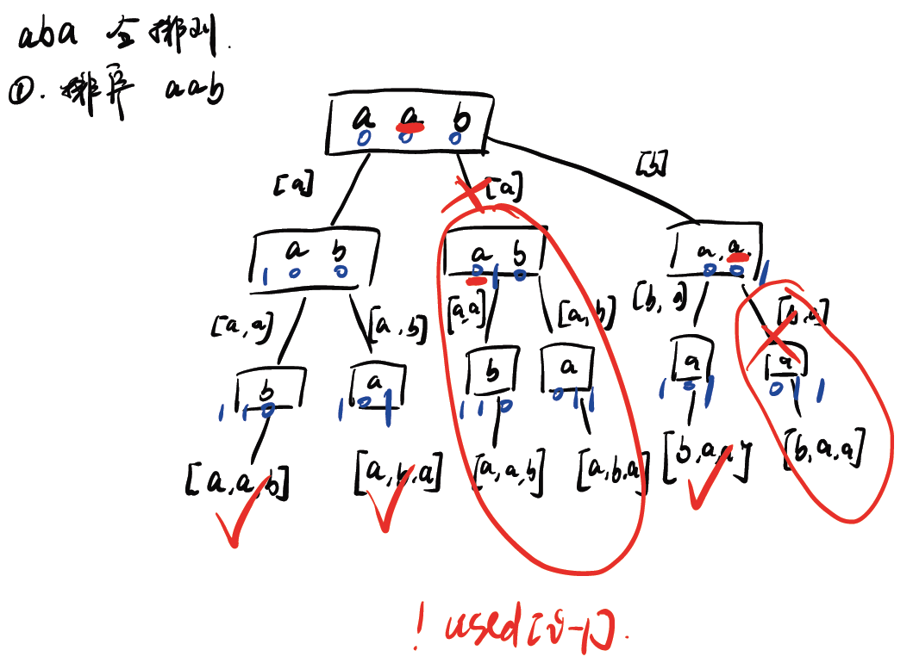

# 													回溯算法

## 回溯算法的术语

`路径` 已经做出的选择

`选择列表` 当前可以做的选择

`结束条件` 到达了决策树的底层，无法再做选择的条件

## 怎么样写回溯算法 ※

- 画出递归树，找到状态变量(回溯函数的参数)，这一步非常重要 ※

- 根据题意，确立结束条件

- 找准选择列表(与函数参数相关),与第一步紧密关联 ※

- 判断是否需要剪枝

- 作出选择，递归调用，进入下一层

- 撤销选择

## 回溯算法代码框架

```c++
void backtrack(路径, 选择列表){
    if 满足结束条件:
        result.add(路径)
        return;
    
    for 选择 in 选择列表:
        做选择
        backtrack(路径, 选择列表)
        撤销选择
}
```

根据下述递归代码框架，`for`循环里面`做选择`属于前序遍历，而`撤销选择`属于后序遍历；之所以这样安排的原因可见下图所示

```c++
void traverse(TreeNode* root) {
    for (TreeNode* child : root->childern)
        // 前序遍历需要的操作
        traverse(child);
        // 后序遍历需要的操作
}
```



## 我的理解

1. 回溯算法本质上是`DFS`的一种应用

2. 利用回溯算法解题时，往往分为两个函数，一个是`backtrack()`函数，用于解决回溯本身,而且这个函数通常返回值是*void*；

   <!--也有特殊情况，backtrack带有返回值的，当只要找到一个结果就行了，需要在找到这个结果的时候就立刻返回，就需要返回值；如果需要找到所有的结果（所有的划分），那么这个时候的backtracking( )不需要返回值，这个时候添加一个参数ans（一个容器），用来装全部的结果。例如 Leetcode 698-->

   另一个是主函数，用以解决问题本身

## 回溯算法可以解决的问题

### 排列问题(permute)

排列问题通常是我们选择了某个数之后，那么他的下一层的选择列表就是除去这个数以外的其他数，其递归树的样子为：



### 子集问题(subset)

由于子集问题的递归树长的如下图所示，`选择列表`里的数，都是选择`路径`(红色框)后面的数

因此，子集问题的回溯函数签名中通常会引入一个`start`的**参数**（不是变量），**来标识当前递归中的选择列表的起始位置**



### 组合问题(combine)

组合问题和子集问题很相似，例如其递归树的样子为：



同样的，也需要一个`start`的**参数**来（不是变量）来记录当前递归中选择列表的起始位置

不同的是，子集问题没有终止条件，每一次的选择（路径）都应该加入到res结果中；但是组合问题是有结束条件的，只有$sum==target$时，路径才加入到结果中。

### 搜索问题

### 小结

可以发现“排列”类型问题和“子集、组合”问题不同在于：“排列”问题使用used数组来标识选择列表，而“子集、组合”问题则使用start参数

## Leetcode相关题目

### 

### [Leetcode 51](https://leetcode-cn.com/problems/n-queens/) N皇后问题

题目描述：将 `n` 个皇后放置在 n×n 的棋盘上，并且使皇后彼此之间不能相互攻击。

给你一个整数 n ，返回所有不同的 n 皇后问题 的解决方案，方案中 'Q' 和 '.' 分别代表了皇后和空位。

`注` 不能相互攻击指的是皇后的行、列、对角线、斜对角线上没有皇后，如下图所示：



```c++
class Solution {
public:
    vector<vector<string>> res;

    void backtrack(vector<string>& board, int row){
        //结束条件
        if(row == board.size()){
            res.push_back(board); //放入皇后结束，将这一幅棋盘存入结果中
            return;
        }

        int n = board.size();
        for(int col = 0; col < n; col++){
            // 排除不合法的情况
            if(!isVaild(board, row, col)) continue;
            // 做选择
            board[row][col] = 'Q';
            // 进入下一层决策
            backtrack(board, row + 1);
            // 撤销选择
            board[row][col] = '.';
        }
    }
    /* 主函数， 返回n皇后问题的结果 */
    vector<vector<string>> solveNQueens(int n) {
        //初始化棋盘
        vector<string> board(n, string(n, '.')); //二维动态数组初始化
        backtrack(board, 0); // 从第0行开始
        return res;
    }

    /* 判断是否可以在 board[row][col] 放置皇后 */
    bool isVaild(vector<string> board, int row, int col){
        int n = board.size();
        /* 只需要检查当前行上方的元素 */
        // 1. 当前列
        for(int i = 0; i < row; i++){
            if(board[i][col] == 'Q') return false;
        }
        // 1. 左上方
        for(int i = row - 1, j = col - 1; i >= 0 && j >= 0; i--, j--){
            if(board[i][j] == 'Q') return false;
        }
        // 1. 右上方
        for(int i = row - 1, j = col + 1; i >= 0 && j < n; i--, j++){
            if(board[i][j] == 'Q') return false;
        }

        return true;
    }
};
```

### [Leetcode 698](https://leetcode-cn.com/problems/partition-to-k-equal-sum-subsets/) 划分k个相等的子集

题目描述：给定一个整数数组 `nums` 和一个正整数 `k`，找出是否有可能把这个数组分成 `k` 个非空子集，其总和都相等。

- 思路一：从每个数字的归属角度

```c++
class Solution {
public:
    /* 
        index : 当前数字的下标
        bucket[i] : 第i个桶内的数字之‘和’
    */
    bool backtrack(vector<int>& nums, int index, vector<int>& bucket, int target){
        // 1 结束条件
        if(index == nums.size()){
            for(int i = 0; i < bucket.size(); i++){
                if(bucket[i] != target) return false;
            }
            return true;
        }

        for(int i = 0; i < bucket.size(); i++){
            // 剪枝，排除一些不合法的情况
            if(bucket[i] + nums[index] > target) continue;
            // 前序遍历，做选择
            bucket[i] += nums[index];
            // 递归，进入下一层决策树，注意有返回值
            if(backtrack(nums, index + 1, bucket, target)) return true;
            // 后序遍历
            bucket[i] -= nums[index];
        }

        return false;
    }

    bool canPartitionKSubsets(vector<int>& nums, int k) {
        // 排除一些基本情况不符合的
        if(k > nums.size()) return false;
        int sum = 0;
        for(auto it : nums) sum += it;
        if(sum % k != 0) return false;

        struct cmp{
            bool operator()(int a, int b){
                return (a > b);
            }
        };
        // 将数组降序排列，使之能够能多的命中剪枝的情况，加快运算速度
        sort(nums.begin(), nums.end(), cmp());

        vector<int> bucket(k, 0);
        int target = sum / k;
        return backtrack(nums, 0, bucket, target);
    }
};
```

`注`

1. ```c++
   bool backtrack(vector<int>& nums, int index, vector<int>& bucket, int target){
   ```

   这个地方，传引用可以节省非常多的内存

   > C++函数参数记得传引用，不要传值，否则递归调用会大量复制 vector 

2. ```C++
   struct cmp{
       bool operator()(int a, int b){
           return (a > b);
       }
   };
   // 将数组降序排列，使之能够能多的命中剪枝的情况，加快运算速度
   sort(nums.begin(), nums.end(), cmp());
   ```

   这个地方如果不做降序排列的话，在Leetcode上无法通过

3. ```c++
   for(int i = 0; i < bucket.size(); i++){
   ```

   这个地方从每个数字角度看的话是要对桶进行遍历，看每个数字该放进那个桶里；相反，在思路二中从桶的角度的话，应该遍历数字，看每个桶该拥有哪个数字

- 思路二：从每个桶的角度

  ```C++
  class Solution {
  public:
      /*
      k : 第k个桶
      bucket : 当前桶中的数字之和
      start ： 从nums[start]元素开始
      used[i] : 某元素是否已经被装入桶里
      */
      bool backtrack(int k, int bucket, vector<int>& nums, int start, vector<bool>& used, int target){
          // 终止条件，k--到头了
          if(k == 0) return true;
          // 当前桶装满了，装下一个桶
          if(bucket == target) return backtrack(k - 1, 0, nums, 0, used, target);
  
          for(int i = start; i < nums.size(); i++){
              // 剪枝
              if(used[i]) continue;
              if(nums[i] + bucket > target) continue;
              // 前序遍历，做选择
              used[i] = true;
              bucket += nums[i];
              // 下一层递归
              if(backtrack(k, bucket, nums, i + 1, used, target)) return true;
              // 撤销选择
              used[i] = false;
              bucket -= nums[i];
          }
  
          return false;
      }
  
      bool canPartitionKSubsets(vector<int>& nums, int k) {
          // 排除一些基本情况
          if (k > nums.size()) return false;
          int sum = 0;
          for (auto it : nums) sum += it;
          if (sum % k != 0) return false;
          
          vector<bool> used(k, 0);
          int target = sum / k;
          // k 号桶初始什么都没装，从 nums[0] 开始做选择
          return backtrack(k, 0, nums, 0, used, target);
      }
  };
  ```

  `注` 
  
  1. 两者算法的时间复杂度分析：
  
     先说第一个解法，也就是从数字的角度进行穷举，`n` 个数字，每个数字有 `k` 个桶可供选择，所以组合出的结果个数为 $k^n$​​，时间复杂度也就是 `O(k^n)`。
  
     第二个解法，每个桶要遍历 `n` 个数字，选择「装入」或「不装入」，组合的结果有 `2^n` 种；而我们有 `k` 个桶，所以总的时间复杂度为 `O(k*2^n)`。
  
     **当然，这是理论上的最坏复杂度，实际的复杂度肯定要好一些，毕竟我们添加了这么多剪枝逻辑**。不过，从复杂度的上界已经可以看出第一种思路要慢很多了。

### [Leetcode 78 子集](https://leetcode-cn.com/problems/subsets/)

题目描述：给你一个整数数组 `nums` ，数组中的元素 **互不相同** 。返回该数组所有可能的子集（幂集）。

```C++
class Solution {
public:
    vector<vector<int>> res;

    void backtrack(vector<int>& nums, vector<int>& path, int start){
        //1 结束条件 不需要
        res.push_back(path);
        
        for(int i = start; i < nums.size(); i++){
            //做选择
            path.push_back(nums[i]);
            //递归
            backtrack(nums, path, i + 1);
            //撤销选择
            path.pop_back();
        }
    }

    vector<vector<int>> subsets(vector<int>& nums) {
        vector<int> path;
        backtrack(nums, path, 0);

        return res;
    }
};
```

`注`

1. 这道题目很特殊的地方在于没有结束条件，这是因为根据这道题的递归树如下所示

   

   每一条`路径`都应该加入结果集，所以不存在结束条件。

2. 递归是从$i + 1$ 开始的，这就是start量的使用
3. 这道题目不需要剪枝，这是因为根据递归树来说，每一条路径都没有重复且都是需要的；但是如下面的子集2就是需要剪枝了，因为nums中存在相同的元素

### [Leetcode 90 子集 II](https://leetcode-cn.com/problems/subsets-ii/)

题目描述：给你一个整数数组 `nums` ，其中可能包含重复元素，请你返回该数组所有可能的子集（幂集）。

```C++
class Solution {
public:
    vector<vector<int>> res;

    void backtrack(vector<int>& nums, vector<int>& path, int start){
        //结束条件 不需要
        res.push_back(path);
        
        for(int i = start; i < nums.size(); i++){
            //剪枝
            if(i > start && nums[i] == nums[i - 1]) continue;
            //做选择
            path.push_back(nums[i]);
            //递归
            backtrack(nums, path, i + 1);
            //撤销选择
            path.pop_back();
        }
    }

    vector<vector<int>> subsetsWithDup(vector<int>& nums) {
        sort(nums.begin(), nums.end()); //先排序才能有效剪枝
        vector<int> path;
        backtrack(nums, path, 0);

        return res;
    }
};
```

`注` 

1. 此题同上89题目的区别就在于本题需要剪枝，因为本题的递归树如下所示：

   

观察上图不难发现，应该去除当前选择列表中，与上一个数重复的那个数，引出的分支，如 “2，2” 这个选择列表，第二个 “2” 是最后重复的，应该去除这个 “2” 引出的分支**（当然，这需要先对nums数组进行排序）**

且，编码中，刚刚说到是 “去除当前选择列表中，与上一个数重复的那个数，引出的分支”，说明当前列表最少有两个数，所以需要加上当 $i > start $​这个条件

2. 注意：剪枝的先决要素是要先对nums数组进行排序

### [Leetcode 39 组合总和](https://leetcode-cn.com/problems/combination-sum/)

题目描述：给定一个**无重复元素**的正整数数组 candidates 和一个正整数 target ，找出 candidates 中所有可以使数字和为目标数 target 的唯一组合。

```C++
class Solution {
public:
    vector<vector<int>> res;

    void backtrack(vector<int>& candidates, vector<int>& path, int target, int start, int sum){
        //结束条件
        if(sum == target){
            res.push_back(path);
            return;
        }

        for(int i = start; i < candidates.size(); i++){
            //剪枝
            if(sum + candidates[i] > target) continue;
            //做选择
            path.push_back(candidates[i]);
            sum += candidates[i];
            //递归
            backtrack(candidates, path, target, i, sum);
            //撤销选择
            path.pop_back();
            sum -= candidates[i];
        }
    }

    vector<vector<int>> combinationSum(vector<int>& candidates, int target) {
        vector<int> path;
        backtrack(candidates, path, target, 0, 0);

        return res;
    }
};
```

`注`

1. sum应当作为一个参数传进来，而不是如下图所示的在递归函数的内部定义

   ```C++
   void backtrack(vector<int>& candidates, vector<int>& path, int target, int start){
       int sum;
       ...
       ...
   }
   ```

   这是因为可以参考参数path，定义在参数列表里的参数，才会跟着递归的层层递进，这个量才会层层叠加起来。

2. 本题的递归树见上所示

### [Leetcode 77 组合](https://leetcode-cn.com/problems/combinations/)

题目描述：给定两个整数 `n` 和 `k`，返回范围 `[1, n]` 中所有可能的 `k` 个数的组合。

```C++
class Solution {
public:
    vector<vector<int>> res;

    void backtrack(int n, int k, vector<int>& path, int start){
        //终止条件
        if(path.size() == k){
            res.push_back(path);
            return;
        }
        for(int i = start; i <= n; i++){
            //剪枝
            //做选择
            path.push_back(i);
            //递归
            backtrack(n, k, path, i + 1);
            //撤销选择
            path.pop_back();
        }
    }

    vector<vector<int>> combine(int n, int k) {
        vector<int> path;
        backtrack(n, k, path, 1);
        return res;
    }
};
```

`注`

1. 有了前面对组合和子集问题的基础，这个题是信手拈来啊~！

### [Leetcode 46](https://leetcode-cn.com/problems/permutations/) “全排列”

题目描述：给定一个不含重复数字的数组 `nums` ，返回其 **所有可能的全排列**。

```c++
class Solution {
public:
    vector<vector<int>> res;

    void backtrack(vector<int> nums, vector<int> track, vector<bool> used){
        // 结束条件
        if(track.size() == nums.size()){
            res.push_back(track);
            return;
        }

        for(int i = 0; i < nums.size(); i++){
            // 排除不合法的选择
            if(used[i] == true) continue;
            // 前序遍历，做选择
            track.push_back(nums[i]);
            used[i] = true;
            // 递归，进入下一层决策树
            backtrack(nums, track, used);
            // 后序遍历，取消选择
            track.pop_back();
            used[i] = false;
        }
    }

    vector<vector<int>> permute(vector<int>& nums) {
        vector<bool> used(nums.size(), false);
        vector<int> track;
        backtrack(nums, track, used);
        return res;
    }
};
```

### [Leetcode 47 全排列 II](https://leetcode-cn.com/problems/permutations-ii/)

题目描述：给定一个可包含重复数字的序列 `nums` ，**按任意顺序** 返回所有不重复的全排列。

```C++
class Solution {
public:
    vector<vector<int>> res;

    void backtrack(vector<int>& nums, vector<int>& track, vector<bool>& used){
        // 结束条件
        if(track.size() == nums.size()){
            res.push_back(track);
            return;
        }

        for(int i = 0; i < nums.size(); i++){
            // 排除不合法的选择
            if(used[i] == true) continue;
            if(i > 0 && nums[i] == nums[i - 1] && !used[i - 1]) continue;
            // 做选择
            track.push_back(nums[i]);
            used[i] = true;
            //递归，进入下一层决策树
            backtrack(nums, track, used);
            // 取消选择
            track.pop_back();
            used[i] = false;
        }
    }

    vector<vector<int>> permuteUnique(vector<int>& nums) {
        sort(nums.begin(), nums.end());
        vector<bool> used(nums.size(), false);
        vector<int> track;
        backtrack(nums, track, used);
        return res;
    }
};
```

`注`

1. 注意这个`剪枝`的语句不同于之前组合的问题

   ```C++
   if(i > 0 && nums[i] == nums[i - 1] && !used[i - 1]) continue;
   ```

   主要是最后一个条件，所以在做排列问题的时候的递归树应当加上used这个量，递归树如下

   

   

### [剑指 Offer 38. 字符串的排列](https://leetcode-cn.com/problems/zi-fu-chuan-de-pai-lie-lcof/)

题目描述：输入一个字符串，打印出该字符串中字符的所有排列。你可以以任意顺序返回这个字符串数组，但里面不能有重复元素。

```C++
class Solution {
public:
    vector<string> res;

    void backtrack(string &s, string& track, vector<bool>& used){
        // 结束条件
        if(track.size() == s.size()){
            res.push_back(track);
            return;
        }

        for(int i = 0; i < s.size(); i++){
            // 排除不合法的选择
            if(used[i] == true) continue;
            if(i > 0 && s[i] == s[i - 1] && !used[i - 1]) continue;
            // 做选择
            track.push_back(s[i]);
            used[i] = true;
            //递归，进入下一层决策树
            backtrack(s, track, used);
            // 取消选择
            track.pop_back();
            used[i] = false;
        }
    }

    vector<string> permutation(string s) {
        sort(s.begin(), s.end());
        vector<bool> used(s.size(), false);
        string track;
        backtrack(s, track, used);
        return res;
    }
};
```

`注`

1. 这题和上述Leetcode47 一模一样，下面为其递归树

   

   其中，注意$used[i - 1]$​还是要剪枝的。

### [37. 解数独](https://leetcode-cn.com/problems/sudoku-solver/)

题目描述：自动填充符合数独的数字

```C++
class Solution {
public:
    //判断 board[i][j]是否可以填入数字 ‘d’
    bool isValid(vector<vector<char>>& board, int r, int c, char d){
        for(int i = 0; i < 9; i++){
            // 判断行内是否存在重复
            if(board[r][i] == d) return false;
            // 判断列内是否存在重复
            if(board[i][c] == d) return false;
            // 判断 3x3 的方格内是否存在重复
            if(board[(r / 3) * 3 + i / 3][(c / 3) * 3 + i % 3] == d) return false;
        }
        return true;
    }

    bool backtrack(vector<vector<char>>& board, int i, int j){
        int r = 9, c = 9;
        // 穷举到最后一列就换到下一行重新开始
        if(j == c) return backtrack(board, i + 1, 0);
        // 穷举完最后一行，找到一个可行解，终止条件
        if(i == r) return true;
        // 如果当前方格有数字，不用我们穷举
        if(board[i][j] != '.') return backtrack(board, i, j + 1);

        for(char ch = '1'; ch <= '9'; ch++){
            //剪枝，如果遇到不合法的数字，跳过
            if(!isValid(board, i, j, ch)) continue;
            // 做选择
            board[i][j] = ch;
            // 递归，且如果找到一个可行解，理解结束
            if(backtrack(board, i, j + 1)) return true;
            // 撤销选择
            board[i][j] = '.';
        }

        return false;
    }

    void solveSudoku(vector<vector<char>>& board) {
        backtrack(board, 0, 0);
    }
};
```

`注`

1. 在判断某一个位置的九宫格的位置使用的语句的是:

   ```C++
   board[(r / 3) * 3 + i / 3][(c / 3) * 3 + i % 3]
   ```

### [剑指 Offer 12. 矩阵中的路径](https://leetcode-cn.com/problems/ju-zhen-zhong-de-lu-jing-lcof/) ★★★

题目描述：给定一个 $m x n$​ 二维字符网格 $board$​ 和一个字符串单词 $word$​ 。如果 $word$​ 存在于网格中，返回 $true$​ ；否则，返回 $false$​ ，路径的前进只能沿着 上下左右 的方格

```C++
class Solution {
public:
    bool exist(vector<vector<char>>& board, string word) {
        // 搜索第一个字符的匹配，从 (i, j) 这个位置开始查找
        for(int i = 0; i < board.size(); i++){
            for(int j = 0; j < board[0].size(); j++){
                if(backtrack(board, word, i, j, 0)) return true;
            }
        }
        return false;
    }

    // count : 当前考虑的字符索引
    bool backtrack(vector<vector<char>>& board, string& word, int i, int j, int count){
        //边界的判断，如果越界直接返回false。count表示的是查找到字符串word的第几个字符，
    	//如果这个字符不等于board[i][j]，说明验证这个坐标路径是走不通的，直接返回false
        if(i >= board.size() || i < 0 || j >= board[0].size() || j < 0 || board[i][j] != word[count]){
            return false;
        }

        // 结束条件 : 全部匹配
        if(count == word.size() - 1) return true;

        char temp = board[i][j];
        // 巧妙的代替新开辟一个visited数组保存访问信息，用一个不存在word中的字符标记已经访问过
        board[i][j] = '\0';
        // 定义 「方向数组」  dx代表方向的第一维，dy代表方向的第二维
        int dx[4] = {-1, 0, 1, 0}, dy[4] = {0, 1, 0, -1};
        // 考虑 上下左右 四个方向
        for(int k = 0; k < 4; k++){
            int m = i + dx[k], n = j + dy[k];
            // 只有 递归的过程中遇到true，才会进入这个分支，返回true，相当于 || 的逻辑
            if(backtrack(board, word, m, n, count + 1)) return true;
        }
        // 恢复现场
        board[i][j] = temp;
        return false;
    }
};
```

`注`

1. 这道题总体来说是符合 回溯算法的模板的，主要的区别是 起点字符匹配的不确定，所以导致主函数exsit()里面需要两重循环从 (i, j) 这个位置开始查找
2. 回溯函数里面，一个设计的巧妙的点是，巧妙的用$board[i][j] = '\0'$​代替新开辟一个visited数组保存访问信息，用一个不存在word中的字符标记已经访问过；然后用$board[i][j] = temp$ 恢复现场
3. 同时在需要查找”上下左右“的元素的时候，需要用到方向数组，这一点也比较巧妙
4. 上面的这行代码其实和下面的代码等效，/只有 递归的过程中遇到true，才会进入这个分支，返回true，相当于 || 的逻辑

```C++
	//上面4个方向，只要有一个能查找到，就返回true；	
	boolean res;
	//往右
	res = dfs(board, word, i + 1, j, index + 1)
	//往左
    res |= dfs(board, word, i - 1, j, index + 1)
    //往下
    res |= dfs(board, word, i, j + 1, index + 1)
    //往上
    res |= dfs(board, word, i, j - 1, index + 1)
```

### [剑指 Offer 13. 机器人的运动范围](https://leetcode-cn.com/problems/ji-qi-ren-de-yun-dong-fan-wei-lcof/)

题目描述：地上有一个$m$行$n$列的方格，从坐标 $[0,0]$ 到坐标 $[m-1,n-1]$ 。一个机器人从坐标$ [0, 0]$​ 的格子开始移动，它每次可以向左、右、上、下移动一格（不能移动到方格外），也不能进入行坐标和列坐标的数位之和大于k的格子。例当k为18时，机器人能够进入方格 [35, 37] ，因为3+5+3+7=18。但它不能进入方格 [35, 38]，因为3+5+3+8=19。请问该机器人能够到达多少个格子？

```C++
class Solution {
public:
    // 全局变量统计个数
    int count = 0;
    int movingCount(int m, int n, int k) {
        vector<vector<bool>> visited(m, vector<bool>(n, false));
        backtrack(m, n, k, 0, 0, visited);
        return count;
    }

    void backtrack(int m, int n, int k, int i, int j, vector<vector<bool>>& visited){
        // 结束条件 base cases
        if(i >= m || i < 0 || j < 0 || j >= n || sums(i, j) > k || visited[i][j])  return;

        count++;
        // 做选择
        visited[i][j] = true;

        // 方向数组
        int dx[4] = {1, 0, 0, -1}, dy[4] = {0, 1, -1, 0};
        for(int t = 0; t < 4; t++){
            int p = i + dx[t];
            int q = j + dy[t];
            backtrack(m, n, k, p, q, visited);
        }
    }

    /* 计算坐标 (i, j) 两个数的数位和之和 */
    int sums(int i, int j){
        int sum = 0;
        while(i != 0){
            sum += i % 10;
            i /= 10;
        }

        while(j != 0){
            sum += j % 10;
            j /= 10;
        }

        return sum;
    }
};
```

`注`

1. 和  [剑指 Offer 12. 矩阵中的路径](https://leetcode-cn.com/problems/ju-zhen-zhong-de-lu-jing-lcof/) ★★★ 相似，需要参考
2. ★★★★★★★ **本题和其他回溯算法的题目有一个巨大的不一样的点，就是没有`撤销选择`这一步骤，这是因为这道题不是说要找到一条路径，所以说当寻找第二条路时原来第一条找过的点可以撤销，重新使用；这道题是要让我们找到所有`可达解`，所以只要走过的点，就永远不能再走了。**

#### [剑指 Offer 34. 二叉树中和为某一值的路径](https://leetcode-cn.com/problems/er-cha-shu-zhong-he-wei-mou-yi-zhi-de-lu-jing-lcof/)

题目描述：输入一棵二叉树和一个整数，打印出二叉树中节点值的和为输入整数的所有路径。`从树的根节点开始往下一直到叶节点所经过的节点形成一条路径`

```C++
class Solution {
public:
    vector<vector<int>> res;

    vector<vector<int>> pathSum(TreeNode* root, int target) {
        vector<int> track;
        backtrack(track, target, 0, root);
        return res;
    }

    void backtrack(vector<int>& track, int target, int curSum, TreeNode* node){
        if(node == NULL) return;

        // 做选择
        track.push_back(node->val);
        curSum += node->val;

        if(curSum== target && node->left == NULL && node->right == NULL){
            res.push_back(track);
        } 

        // 递归，进入下一层决策
        backtrack(track, target, curSum, node->left);
        backtrack(track, target, curSum, node->right);

        // 撤销选择
        track.pop_back();
        curSum -= node->val;
    }
};
```

`注`

1. ```C++
   if(curSum== target && node->left == NULL && node->right == NULL){
   	res.push_back(track);
   }
   ```

   这个后面不需要return
