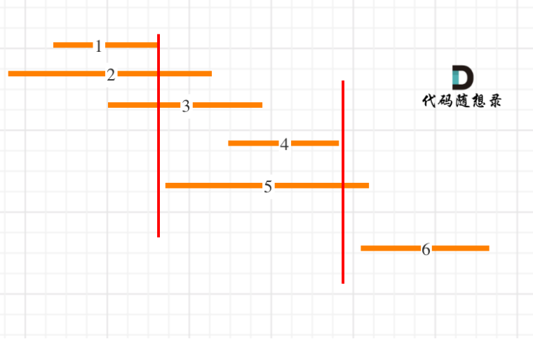
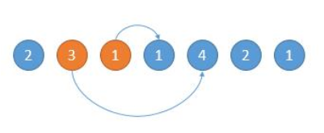
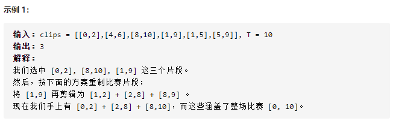
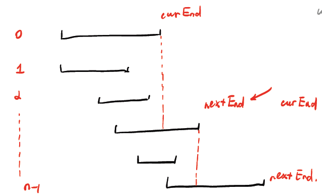

# 					贪心算法（动态规划的特例）

## 基本概念

贪心算法可以认为是动态规划算法的一个特例，相比动态规划，使用贪心算法需要满足更多的条件（贪心选择性质），但是效率比动态规划要高
比如说一个算法问题使用暴力解法需要指数级时间；如果能使用动态规划消除重叠子问题，就可以降到多项式级别的时间；如果满足贪心选择性质，那么可以进一步降低时间复杂度，达到线性级别的

贪心选择性质简单说就是：「每一步都做出一个局部最优的选择，最终的结果就是全局最优」，注意哦，这是一种特殊性质，其实只有一部分问题拥有这个性质

## 小结

贪心就是这样，代码有时候很简单（不是指代码短，而是逻辑简单），但想法是真的难！

这和动态规划还不一样，动规的代码有个递推公式，可能就看不懂了，而贪心往往是直白的代码，但想法读不懂，哈哈。

## 相关题目

#### [435. 无重叠区间](https://leetcode-cn.com/problems/non-overlapping-intervals/)

题目描述：给定一个区间的集合，找到需要移除区间的最小数量，使剩余区间互不重叠。

```C++
class Solution {
public:
    int eraseOverlapIntervals(vector<vector<int>>& intervals) {
        //1 按照区间的 end 值升序排列
        struct cmp{
            bool operator()(vector<int>& a, vector<int>& b){
                return a[1] < b[1];
            }
        };
        sort(intervals.begin(), intervals.end(), cmp());

        int count = 1; // 至少会有 1 个区间不相交
        int cur_end = intervals[0][1];
        for(auto interval : intervals){
            int start = interval[0];
            if(start >= cur_end){
                count++;
                cur_end = interval[1];
            }
        }

        return intervals.size() - count;
    }
};
```

`注`

1. 本题的思路：按照右边界排序，就要从左向右遍历，因为右边界越小越好，只要右边界越小，留给下一个区间的空间就越大，所以从左向右遍历，优先选右边界小的。**最后用区间总数减去非交叉区间的个数就是需要移除的区间个数了**。

   右边界排序之后，局部最优：优先选右边界小的区间，所以从左向右遍历，留给下一个区间的空间大一些，从而尽量避免交叉。全局最优：选取最多的非交叉区间。

   

2. > **前文多次说过，区间问题肯定按照区间的起点或者终点进行排序**

#### [452. 用最少数量的箭引爆气球](https://leetcode-cn.com/problems/minimum-number-of-arrows-to-burst-balloons/)

只需要注意 $intervalSchedule$ 算法中，如果两个区间的边界触碰，不算重叠；而按照 #452 的描述，箭头如果碰到气球的边界气球也会爆炸，所以说相当于区间的边界触碰也算重叠

#### [55. 跳跃游戏](https://leetcode-cn.com/problems/jump-game/)

题目描述：数组中的每个元素代表你在该位置可以跳跃的最大长度，判断你是否能够到达最后一个下标。

```C++
class Solution {
public:
    bool canJump(vector<int>& nums) {
        int n = nums.size();
        int farthest = 0;
        for(int i = 0; i < n - 1; i++){
            // 每一步都计算从当前位置最远能够跳到哪里
            farthest = max(farthest, i + nums[i]);
            // 可能碰到了 '0' ，卡住无法向前跳了
            if(farthest <= i) return false;
        }

        return farthest >= n - 1;
    }
};
```

`注`

1. 

#### [45. 跳跃游戏 II](https://leetcode-cn.com/problems/jump-game-ii/)

题目描述：数组中的每个元素代表你在该位置可以跳跃的最大长度，计算使用最少的跳跃次数到达数组的最后一个位置

```C++
class Solution {
public:
    int jump(vector<int>& nums) {
        int count = 0;
        int end = 0;
        int maxPos = 0;

        for(int i = 0; i < nums.size() - 1; i++){
            maxPos = max(maxPos, i + nums[i]);
            
            if(i == end){
                end = maxPos;
                count++;
            }
        }
        return count;
    }
};
```

`注`

1. 本题的贪心思路为：对于数组 $nums = [2, 3, 1, 1, 4]$​ ，从数组的第 0 个位置开始跳，跳的距离小于等于数组上对应的数。求出跳到最后个位置需要的最短步数。比如上述数组中的第 0 个位置是 2，那么可以跳 1 个距离，或者 2 个距离，我们选择跳 1 个距离，就跳到了第 1 个位置，也就是 3 上。然后我们可以跳 1，2，3 个距离，我们选择跳 3 个距离，就直接到最后了。所以总共需要 2 步。

   所以：解题步骤为：

   - 如下图，开始的位置是 2，可跳的范围是橙色的。然后因为 3 可以跳的更远，所以跳到 3 的位置。

   

   - 如下图，然后现在的位置就是 3 了，能跳的范围是橙色的，然后因为 4 可以跳的更远，所以下次跳到 4 的位置

   

#### [1024. 视频拼接](https://leetcode-cn.com/problems/video-stitching/)

题目描述：



```C++
class Solution {
public:
    int videoStitching(vector<vector<int>>& clips, int time) {
        // 1 区间问题，先排序：对 clips 按照起点升序排序，起点相同的按照终点降序排序
        struct cmp{
            bool operator()(vector<int>& a, vector<int>& b){
                if(a[0] == b[0]) return a[1] > b[1];
                return a[0] < b[0];
            }
        };
        sort(clips.begin(), clips.end(), cmp());

        int count = 0;
        int curEnd = 0;
        int nextEnd = 0;
        int n = clips.size();
        int i = 0;

        while (i < n && clips[i][0] <= curEnd) {
            // 在第 res 个视频的区间内贪心选择下一个视频
            while (i < n && clips[i][0] <= curEnd) {
                nextEnd = max(nextEnd, clips[i][1]);
                i++;
            }
            // 找到下一个视频，更新 curEnd
            count++;
            curEnd = nextEnd;
            if (curEnd >= time) {
                // 已经可以拼出区间 [0, T]
                return count;
            }
        }

        // 无法连续拼出区间 [0, T]
        return -1;
    }
};
```

`注`

1. 本题的贪心思想为：是先按照起点升序排序，如果起点相同的话按照终点降序排序。

   为什么这样排序呢，主要考虑到这道题的以下两个特点：

   1、要用若干短视频凑出完成视频 `[0, T]`，至少得有一个短视频的起点是 0。

   这个很好理解，如果没有一个短视频是从 0 开始的，那么区间 `[0, T]` 肯定是凑不出来的。

   2、如果有几个短视频的起点都相同，那么一定应该选择那个最长（终点最大）的视频。

   具体过程如下图所示：

   

2. 本题的coding中，需要特别主要两个while循环，很巧妙：内层while循环寻找在当前的curEnd区间内，头部不超过curEnd的最大区间；外层while循环用来在找到一个区间后，继续向后寻找下一个视频区间

#### [剑指 Offer 14- II. 剪绳子 II](https://leetcode-cn.com/problems/jian-sheng-zi-ii-lcof/)

题目描述：给你一根长度为 n 的绳子，请把绳子剪成整数长度的 m 段（m、n都是整数，n>1并且m>1），每段绳子的长度记为 k[0],k[1]...k[m - 1] 。请问$k[0]*k[1]*...*k[m - 1] $​​可能的最大乘积是多少？例如，当绳子的长度是8时，我们把它剪成长度分别为2、3、3的三段，此时得到的最大乘积是18。

- `2 <= n <= 1000`

```C++
class Solution {
public:
    int cuttingRope(int n) {
        // 根据数学证明，将绳子将可能多的剪成长度为 3 的段，乘积更大
        long res = 1;
        if(n <= 1) return 0;
        else if(n == 2) return 1;
        else if(n == 3) return 2;
        else if(n == 4) return 4;
        else if(n > 4){
            while(n > 4){
                res = (res * 3) % 1000000007;
                n -= 3;
            }
        }

        return res * n % 1000000007;
    }
};
```

`注`

1. 首先只有当按照如下的策略来剪绳子，将得到最大的乘积：
   - 当 $n >= 5$ ：尽可能多的剪长度为3的绳子
   - 当剩下的绳子长度为4时，把绳子剪成两端长度为2的绳子

2. 然后，证明这种策略的正确性（详见《剑指Offer》P98）


## 参考资料

1. 