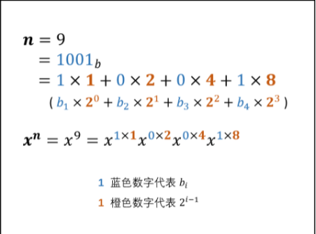

# 快速幂法

## 时间复杂度分析

求 $x^n$ 最简单的方法是通过循环将 $n$ 个 $x$ 乘起来，依次求 $x^1, x^2, ..., x^{n-1}, x^n$ ，时间复杂度为 $O(n)$ 。
快速幂法 可将时间复杂度降低至 $O(log_2 n)$


## 从「二进制」的角度解析

对于任何十进制正整数 $n$ ，设其二进制为 $"b_m...b_3b_2b_1 "$（ $b_i$  为二进制某位值，$i \in [1,m]i∈[1,m] $），则有：

- 二进制转十进制： $n = 1b_1 + 2b_2 + 4b_3 + ... + 2^{m-1}b_m$  （即二进制转十进制公式）
- 幂的二进制展开：$ x^n = x^{1b_1 + 2b_2 + 4b_3 + ... + 2^{m-1}b_m} =x^{1b_1}x^{2b_2}x^{4b_3}...x^{2^{m-1}b_m}$

根据以上推导，可把计算 $x^n$​转化为解决以下两个问题：

- 计算 $x^1, x^2, x^4, ..., x^{2^{m-1}}$​  的值： 循环赋值操作 $x = x^2$​即可
- 获取二进制各位 $b_1, b_2, b_3, ..., b_m$​ 的值： 循环执行以下操作即可
  - $n \& 1$​（与操作）： 判断 $n$​ 二进制最右一位是否为 $1$​ 
  - $n>>1$​ （移位操作）： $n$​​ 右移一位（可理解为删除最后一位）



## 代码实现

```C++
class Solution {
public:
    double myPow(double x, int n) {
        if(x == 0) return 0;
        long b = n;
        double res = 1.0;
        if(b < 0) {
            x = 1 / x;
            b = -b;
        }
        while(b > 0) {
            if((b & 1) == 1) res *= x;
            x *= x;
            b >>= 1;
        }
        
        return res;
    }
};
```

`注`

1. 代码中 int32 变量 $n \in [-2147483648, 2147483647]n∈[−2147483648,2147483647]$，因此当 $n = -2147483648$ 时执行 $n = -n$ 会因越界而赋值出错。解决方法是先将 $n$ 存入 long 变量 $b$ ，后面用 $b$ 操作即可。

   

## 代码实现 2（剑指Offer）基于二分

```C++
class Solution {
public:
    double myPow(double x, int n) {
        long b = n;
        unsigned long absExponent = (unsigned long)(b);
        if(b < 0) absExponent = (unsigned long)(-b);

        double res = PowWithUnsignedExponent(x, absExponent);
        if(b < 0) res = 1.0 / res;

        return res; 
    }

    double PowWithUnsignedExponent(double base, unsigned int exponent){
        double res;
        if(exponent == 0) return 1;
        if(exponent == 1) return base;
        
        // 递归的求
        res = PowWithUnsignedExponent(base, exponent >> 1);
        res *= res;

        // 如果是奇数次方，则多乘上base
        if(exponent & 0x1 == 1)
        res *= base;

        return res;
    }
};
```

`注`

1. 如果$n == 0$​​​，返回1
   如果$n < 0$​​​，最终结果为$ 1/x^{-n}$​​​
   如果$n$​​​为奇数，最终结果为 $x * x ^ {n - 1}$​
   如果$n$为偶数，最终结果为 $x ^ {2*(n/2)}$​
   
   
