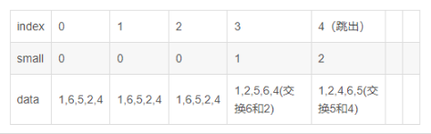

# 排序算法

## 排序算法分类

- 快速排序：剑指offer 2.4.2

- 归并排序

  

## 快速排序

### 基本思路

先在数组中选择一个数字，接下来把数组中的数字分成两部分，比选择的数字小的数字移到数组的左边，比选择的数字大的数字移到数组的右边

### 代码实现

```C++
class Solution {
public:
    vector<int> sortArray(vector<int>& nums) {
        QuickSort(nums, nums.size(), 0, nums.size() - 1);
        return nums;      
    }

    void QuickSort(vector<int>& nums, int length, int start, int end){
        // base case
        if(start == end) return;

        int index = Partition(nums, length, start, end);
        if(index > start) QuickSort(nums, length, start, index - 1);
        if(index < end) QuickSort(nums, length, index + 1, end);
    }

    // 快速排序，「优美」
    // 返回值 切分的index
    int Partition(vector<int>& nums, int length, int start, int end){
        // 生成 [start, end] 之间的随机数，将这个索引对应的元素作为基准
        int index = rand() % (end - start + 1) + start; 

        // 交换基准元素和最后一个元素，也就是将基准元素放到最后去
        swap(nums[index], nums[end]);
        // small 用来记录 「下标小于 small 的元素均小于 基准元素」
        int small = start - 1;

        // for循环遍历整个数组  由于基准元素已经放在最后，所以index没有用了，这里作为遍历数组的下标
        // 特别注意这里是 「< end」 而不是 「< length」，即只会遍历到数组的倒数第二个元素（最后一个是基准，不用遍历）
        for(index = start; index < end; index++){
            // 如果当前遍历的元素小于基准元素
            if(nums[index] < nums[end]){
                //即 小于基准元素的元素+1个
                small++;
                // 把小的元素换到前面的对应的small个元素的位置去
                swap(nums[index], nums[small]);
            }
        }
        
        // <= small 的元素都比基准元素小了，那么我们将基准元素放到 small + 1 的位置
        small++;
        swap(nums[small], nums[end]);

        return small;
    }
};
```

`举例说明`

- 假如数据为 $data = [1, 6, 4, 2, 5]$​， $start = 0$, $end = 4$,   随机的 $index = 2$​​​，那么运行过程为

  

### 在题目中的应用

#### [剑指 Offer 40. 最小的k个数](https://leetcode-cn.com/problems/zui-xiao-de-kge-shu-lcof/) ★★

题目描述：输入整数数组 $arr$​ ，找出其中最小的 $k$​ 个数。例如，输入$4、5、1、6、2、7、3、8$​这8个数字，则最小的4个数字是$1、2、3、4$​​

`思路一` **快速选择——退化的快速排序**

```C++
class Solution {
public:
    vector<int> getLeastNumbers(vector<int>& arr, int k) {
        if(k == 0) return {};
        int start = 0;
        int end = arr.size() - 1;
        int index = Partition(arr, start, end);

        while(index + 1 != k){
            if(index + 1 > k){
                end = index - 1;
                index = Partition(arr, start, end);
            }
            else{
                start = index + 1;
                index = Partition(arr, start, end);
            }
        }

        vector<int> res;
        for(int i = 0; i <= index; i++){
            res.push_back(arr[i]);
        }
        
        return res;
    }
    
    int Partition(vector<int>& nums, int start, int end){
        // 基准数字选择数组中下标为 k 的元素，则使得比第 k 个数字小的所有数字都位于数组的左边
        int index = rand() % (end - start + 1) + start;
        
        // 表示数组中比基准元素小的个数 - 1 (表示的下标)
        int small = start - 1;

        // 将基准元素放到最后
        swap(nums[index], nums[end]);

        // 只需要遍历到数组的倒数第 2 个元素，因为最后一个是基准元素不用考虑
        for(index = start; index < end; index++){
            if(nums[index] < nums[end]){
                small++;
                swap(nums[index], nums[small]);
            }
        }

        small++;
        swap(nums[end], nums[small]);

        return small;
    }
};
```

`注`

1. 采用了 `Partition` 函数，和之前写的是一模一样的，其思路为，假设经过一次 $Partition$​​​ 操作，基准元素位于下标 $index$​​​，也就是说左侧的数组 + 基准元素本身 有 $index + 1$​​​ 个元素，是原数组中最小的 $index + 1$​​​​​​ 个数，那么：
   - 若 $k = index + 1$​​，我们就找到了最小的 $k$​​ 个数，就是左侧的数组                                 
   - 若 $k < index + 1$​ ，则最小的 $k$​ 个数一定都在左侧数组中，我们只需要对左侧数组 $Parition$​ 即可
   - 若 $k > index + 1$，则左侧数组中的 $index + 1$ 个数都属于最小的 $k$ 个数，我们还需要在右侧数组中寻找最小的 $k-（index + 1）$ 个数，对右侧数组 $Partition$​​ 即可
2.  `Partition` 函数的时间复杂度为 O(n)

`思路二` ：利用大顶堆

```C++
class Solution {
public:
    vector<int> getLeastNumbers(vector<int>& arr, int k) {
        if(arr.empty() || k == 0) return {};
        vector<int> res;
        // 构建一个大顶堆
        priority_queue<int> max_heap;

        for(int i = 0; i < k; i++){
            max_heap.push(arr[i]);
        }

        for(int i = k; i < arr.size(); i++){
            if(arr[i] < max_heap.top()){
                max_heap.pop();
                max_heap.push(arr[i]);
            }
        }

        for(int i = 0; i < k; i++){
            res.push_back(max_heap.top());
            max_heap.pop();
        }

        return res;
    }
};
```

`注`

- 先将 $arr$ 的前 $k$ 个数入堆，因为是最大堆，所以堆顶的数一定是最大的。
- 那么我们再从 $arr$ 的第 $k + 1$ 个元素迭代起，凡是遇到比当前堆顶元素小的，就将该元素 $push$ 入堆并 $pop$ 掉堆顶元素。
- 注意，每次执行完第二步之后，堆会自动更新，以保证堆顶元素始终为堆中所有元素的最大值。

> 两种方法的优劣性比较
> 在面试中，另一个常常问的问题就是这两种方法有何优劣。看起来分治法的快速选择算法的时间、空间复杂度都优于使用堆的方法，但是要注意到快速选择算法的几点局限性：

> 第一，算法需要修改原数组，如果原数组不能修改的话，还需要拷贝一份数组，空间复杂度就上去了。

>  第二，算法需要保存所有的数据。如果把数据看成输入流的话，使用堆的方法是来一个处理一个，不需要保存数据，只需要保存 k 个元素的最大堆。而快速选择的方法需要先保存下来所有的数据，再运行算法。当数据量非常大的时候，甚至内存都放不下的时候，就麻烦了。所以当数据量大的时候还是用基于堆的方法比较好。

#### [剑指 Offer 39. 数组中出现次数超过一半的数字](https://leetcode-cn.com/problems/shu-zu-zhong-chu-xian-ci-shu-chao-guo-yi-ban-de-shu-zi-lcof/)

题目描述：数组中有一个数字出现的次数超过数组长度的一半，请找出这个数字。你可以假设数组是非空的，并且给定的数组总是存在多数元素。

```C++
class Solution {
public:
    int majorityElement(vector<int>& nums) {
        if(nums.size() == 1) return nums[0];
        int start = 0;
        int end = nums.size() - 1;
        int middle = nums.size() >> 1;
        int index = Partition(nums, start, end);
        while(index != middle){
            // 说明中位数在当前index的右边
            if(index < middle){
                start = index + 1;
                index = Partition(nums, start, end);
            }
            else{
                end = index - 1;
                index = Partition(nums, start, end);
            }
        }

        return nums[middle];
    }

    // 先写出经典的Partition()函数
    int Partition(vector<int>& nums, int start, int end){
        // index 为随机的基准元素，返回下标为 [start, end] 的随机数
        int index = random() % (end - start + 1) + start;

        swap(nums[index], nums[end]);
        // 记录比基准元素小的元素的个数 — 1（即下标）
        int small = start - 1;

        for(index = start; index < end; index++){
            if(nums[index] < nums[end]){
                small++;
                if(index != small){
                    swap(nums[index], nums[small]);
                }
            }
        }

        small++;
        swap(nums[small], nums[end]);

        return small;
    }


};
```

`注`

1. 本题依旧可以使用$Partition()$函数，这种算法收到快速排序算法的启发：如果$Partition()$之后的下标index，则说明恰好是中位数所在的下标，否则往左右两边搜索


## 归并排序

### 基本思路

归并排序（MERGE-SORT）是利用**归并**的思想实现的排序方法，该算法采用经典的**分治**（divide-and-conquer）策略（分治法将问题**分**(divide)成一些小的问题然后递归求解，而**治(conquer)**的阶段则将分的阶段得到的各答案"修补"在一起，即分而治之)


`关键步骤` **合并相邻有序子序列**

​	再来看看**治**阶段，我们需要将两个已经有序的子序列合并成一个有序序列，比如上图中的最后一次合并，要将[4,5,7,8]和[1,2,3,6]两个已经有序的子序列，合并为最终序列[1,2,3,4,5,6,7,8]，来看下实现步骤。


### 代码实现

```C++
class Solution {
public:
    //int global_count = 0; // 1
    vector<int> temp;

    vector<int> sortArray(vector<int>& array) {
        // 在排序前，先建好一个长度等于原数组长度的临时数组，避免递归中频繁开辟空间
        temp.resize(array.size(), 0);
        sort(array, 0, array.size() - 1);

        return array; // 修改返回值
    }

    void MergeArray(vector<int>& array, int l, int mid, int r){
        int i = l;

        int p1 = l; //指向待合并的第一个数组
        int p2 = mid + 1; //指向待合并的第二个数组
        
		// 先将原始数据拷贝一份，之后再合并回原数组中
        for(int k = l; k <= r; k++){
            temp[k] = array[k];
        }

        // 比较左右两部分的元素，哪个小，把那个元素填入temp中
        while(p1 <= mid && p2 <= r){
            if(temp[p1] <= temp[p2]){
                array[i++] = temp[p1++]; 
            }
            else{
                //global_count += mid - p1 + 1;
                array[i++] = temp[p2++];
            }
        }

        //上面的循环退出后，把剩余的元素依次填入到temp中,以下两个while只有一个会执行
        while(p1 <= mid){
            array[i++] = temp[p1++];
        }
        while(p2 <= r){
            array[i++] = temp[p2++];
        }
    }

    void sort(vector<int>& array, int l, int r){
        if(l >= r) return;
        int mid = l + (r - l) / 2;
        //左边归并排序，使得左子序列有序
        sort(array, l, mid);
        //左边归并排序，使得左子序列有序
        sort(array, mid + 1, r);
        //将两个有序子数组合并操作
        MergeArray(array, l, mid, r);
    }
};
```

### 在题目中的应用

#### [剑指 Offer 51. 数组中的逆序对](https://leetcode-cn.com/problems/shu-zu-zhong-de-ni-xu-dui-lcof/)

题目描述：在数组中的两个数字，如果前面一个数字大于后面的数字，则这两个数字组成一个逆序对。输入一个数组，求出这个数组中的逆序对的总数

```C++
class Solution {
public:
    int global_count = 0; // 修改1
    vector<int> temp;

    int reversePairs(vector<int>& array) {
        // 在排序前，先建好一个长度等于原数组长度的临时数组，避免递归中频繁开辟空间
        temp.resize(array.size(), 0);
        sort(array, 0, array.size() - 1);

        return global_count; // 修改2 修改返回值
    }

    void MergeArray(vector<int>& array, int l, int mid, int r){
        int i = l;

        int p1 = l; //指向待合并的第一个数组
        int p2 = mid + 1; //指向待合并的第二个数组

        for(int k = l; k <= r; k++){
            temp[k] = array[k];
        }

        // 比较左右两部分的元素，哪个小，把那个元素填入temp中
        while(p1 <= mid && p2 <= r){
            if(temp[p1] <= temp[p2]){
                array[i++] = temp[p1++]; 
            }
            else{
                global_count += mid - p1 + 1; //修改 3
                array[i++] = temp[p2++];
            }
        }

        //上面的循环退出后，把剩余的元素依次填入到temp中,以下两个while只有一个会执行
        while(p1 <= mid){
            array[i++] = temp[p1++];
        }
        while(p2 <= r){
            array[i++] = temp[p2++];
        }
    }

    void sort(vector<int>& array, int l, int r){
        if(l >= r) return;
        int mid = l + (r - l) / 2;
        //左边归并排序，使得左子序列有序
        sort(array, l, mid);
        //左边归并排序，使得左子序列有序
        sort(array, mid + 1, r);
        //将两个有序子数组合并操作
        MergeArray(array, l, mid, r);
    }
};
```

`注`

1. 只在 `归并排序` 实现的基础上，增加了统计逆序对的 $global_count += mid - p1 + 1$​ 的代码； 为什么可以这样统计逆序对：

   

   是因为在合并的过程中，每当p2++，意味着`当前`左边的数组中的所有元素（$mid - p1 + 1$ 个）都大于 当前的 array[p2]，所以贡献$mid - p1 + 1$ 个逆序对

   参考视频：https://leetcode-cn.com/problems/shu-zu-zhong-de-ni-xu-dui-lcof/solution/shu-zu-zhong-de-ni-xu-dui-by-leetcode-solution/

2. 打卡，典型的不能再典型的归并排序实现，类似的逆序对的题目有如下：315（和本题一样）,327,493, 做完这三道相信归并排序的理解会更加深入

   用粗糙的归并也会超时（自己第一次写的就是这样），优化方法： 1.不要每次都单独开一个辅助数组，而是通过引用等方式，使用同一个空间2.辅助数组只复制nums的部分信息，即[left,right]区间
