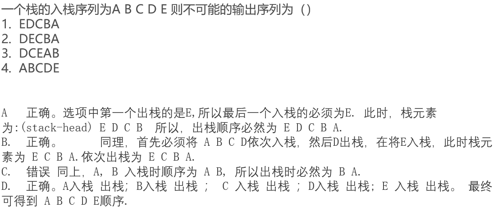

# 栈

## 栈的基本操作

#### [剑指 Offer 30. 包含min函数的栈](https://leetcode-cn.com/problems/bao-han-minhan-shu-de-zhan-lcof/)

题目描述：定义栈的数据结构，请在该类型中实现一个能够得到栈的最小元素的 $min$ 函数在该栈中，调用 $min$、$push$ 及 $pop$ 的时间复杂度都是 $O(1)$

```C++
class MinStack {
public:
    /** initialize your data structure here. */
    MinStack() {

    }
    
    void push(int x) {
        dataStk.push(x);
        // 关键：如果新入栈元素小于栈中的最小值（辅助栈的栈顶元素），则将最小值压入辅助栈；否则重复压入之前的最小值（辅助栈的栈顶元素）
        if(minStk.empty() || x < minStk.top()){
            minStk.push(x);
        }
        else{
            minStk.push(minStk.top());
        }
    }
    
    void pop() {
        dataStk.pop();
        minStk.pop();
    }
    
    int top() {
        return dataStk.top();
    }
    
    int min() {
        return minStk.top();
    }

private:
    stack<int> dataStk; // 数据栈
    stack<int> minStk; // 辅助栈
};
```

`注`

1. 这道题的编码比较简单，主要 是要想到思路，思路参考了剑指P166：设计一个数据栈和一个`辅助栈`，其中数据栈执行栈的基本操作（push/pop/top），辅助栈用来保存数据栈中的最小元素，如果新入栈元素小于栈中的最小值（辅助栈的栈顶元素），则将最小值压入辅助栈；否则重复压入之前的最小值（辅助栈的栈顶元素）

   例如：首先往空的数据栈里压入数字3，显然现在3是最小值，我们也把这个最小值压入辅助栈。接下来往数据栈里压入数字4。由于4大于之前的最小值，因此我们仍然往辅助栈里压入数字3。

   

#### [剑指 Offer 31. 栈的压入、弹出序列](https://leetcode-cn.com/problems/zhan-de-ya-ru-dan-chu-xu-lie-lcof/)

题目描述：输入两个整数序列，第一个序列表示栈的压入顺序，请判断第二个序列是否为该栈的弹出顺序。假设压入栈的所有数字均不相等。例如，序列 {1,2,3,4,5} 是某栈的压栈序列，序列 {4,5,3,2,1} 是该压栈序列对应的一个弹出序列，但 {4,3,5,1,2} 就不可能是该压栈序列的弹出序列

`题目来源`：



```C++
class Solution {
public:
    bool validateStackSequences(vector<int>& pushed, vector<int>& popped) {
        stack<int> stk;
        int n = popped.size();
        // j 用来遍历 弹出序列数组
        int j = 0;

        for(int i = 0; i < n; i++){
            stk.push(pushed[i]);
            while(!stk.empty() && stk.top() == popped[j]){
                // 每匹配弹出一个 j++
                j++;
                stk.pop();
            }
        }

        return j == n;
    }
};
```

`注`

1. 思路比较简单，我们尝试按照 popped 中的顺序模拟一下出栈操作，如果符合则返回 true，否则返回 false

   这里用到的贪心法则是如果栈顶元素等于 popped 序列中下一个要 pop 的值，则应立刻将该值 pop 出来

   我们使用一个栈 stk 来模拟该操作。将 pushed 数组中的每个数依次入栈，同时判断这个数是不是 popped 数组中下一个要 pop 的值，如果是就把它 pop 出来

   最后检查popped数组是否完全遍历

   


## 单调栈