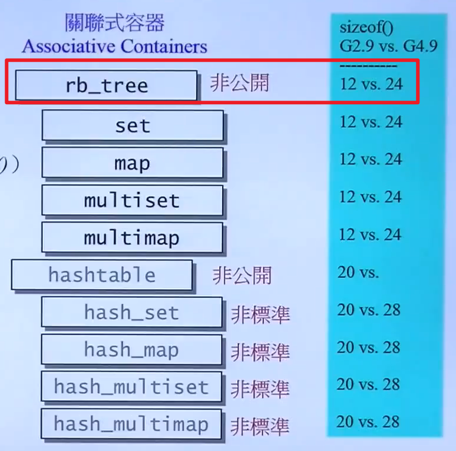
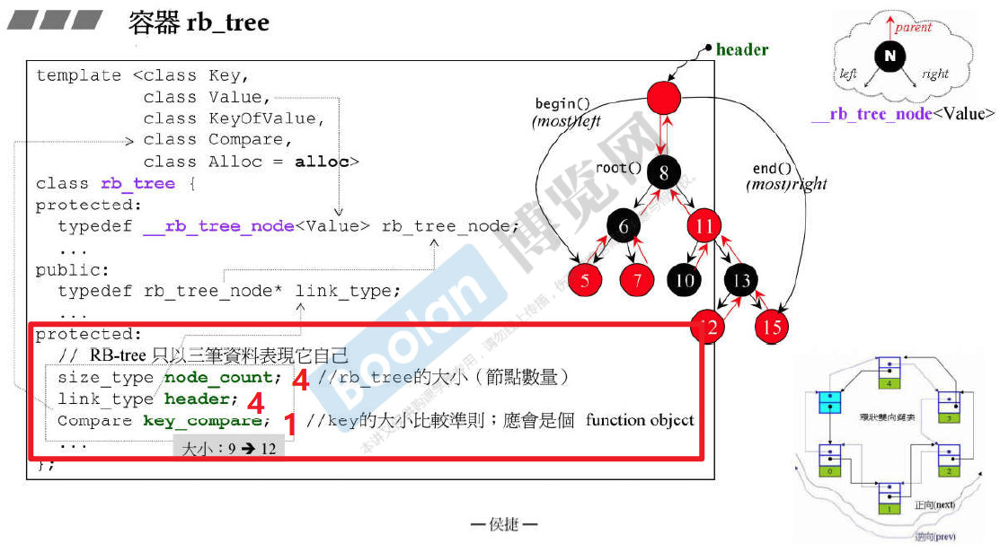
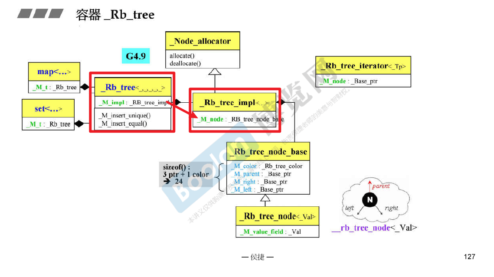
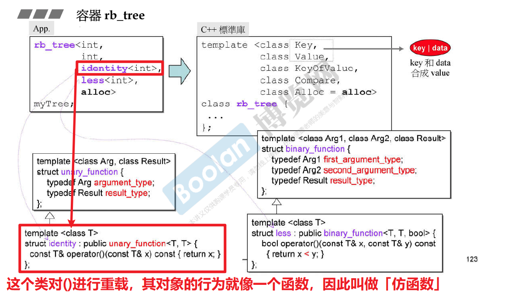

# 红黑树 RB tree

## 概述

- **关联式容器在标准库中使用 红黑树 或者 散列表 (hash table 哈希表) 来实现**

- **红黑树 是一种 平衡二叉搜索树 (balanced binary search tree)**，**其排列的规则会有利于 search 和 insert，并保持适度平衡**
- **红黑树提供遍历操作及 iterator ，且按照正常规则(++ite)遍历【中序遍历】，便能获得排序的状态**
- **不应该使用红黑树的迭代器的 iterator改变元素值（会打破排序的状态）；但是编程层面并未禁止此事，如此设计是正确的，因为红黑树将为 map 服务，而 map 允许元素的 value 被改变，只有元素的 key 才是不可以被改变的**
- **红黑树提供两种 insertion 操作，insert_unique() 和 insert_euqal()；前者表示节点的 key 一定在整棵树中独一无二，否则安插失败；后者表示节点的 key 可以重复**

## 红黑树的实现

### 类的大小

#### GNU2.9 版本

- 如上图所示，Compare类中没有数据成员，其类的对象大小为 1，在编译程序的时候，对其 4的倍数，因此 $9->12$，大小为12字节

#### GNU4.9 版本

GNU2.9版本采取的是单一class 的设计；但是GNU4.9版本采取的是handle and body 的设计，将类的实现用一个指针传入，如下图所示：

- > 这里为啥是24，三个指针12字节，1个枚举类型为啥是12字节？

  

### 红黑树的模板参数解释

- KeyOfValue ：表示的是如何从 「元素」 中取出 key 的部分，如[例子](# 直接使用红黑树)中所示，key就是value，value就是key，因此仿函数直接返回本身就可以

## 直接使用红黑树

如下图所示：

