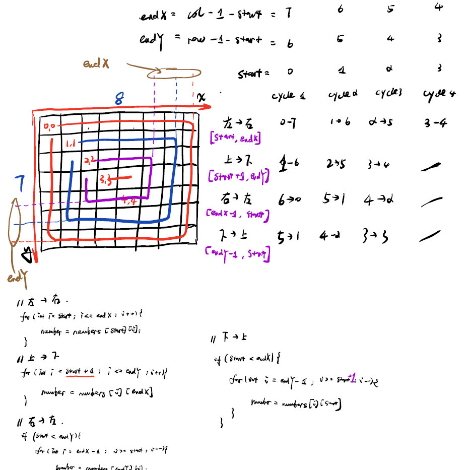
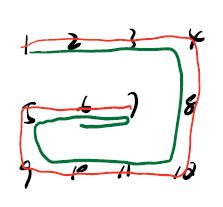

# 编程基础-边界值找规律

### [剑指 Offer 29. 顺时针打印矩阵](https://leetcode-cn.com/problems/shun-shi-zhen-da-yin-ju-zhen-lcof/)

题目描述：输入一个矩阵，按照从外向里以顺时针的顺序依次打印出每一个数字

```C++
// 参考剑指Offer，有修改，删去了部分冗余的条件，并修正为leetcode题目输出要求
class Solution {
public:
    vector<int> res;

    vector<int> spiralOrder(vector<vector<int>>& matrix) {
        if(matrix.size() == 0) return {};

        int start = 0;
        int row = matrix.size();
        int col = matrix[0].size();

        while(col > start * 2 && row > start * 2){
            MatrixInCircle(matrix, col, row, start);
            start++;
        }

        return res;
    }

    void MatrixInCircle(vector<vector<int>>& matrix, int col, int row, int start){
        int endX = col - 1 - start;
        int endY = row - 1 - start;

        for(int i = start; i <= endX; i++){
            res.push_back(matrix[start][i]);
        }


        for(int i = start + 1; i <= endY; i++){
            res.push_back(matrix[i][endX]);
        }


        if(start < endY){ // 这个条件很关键，可以防止走回头路，可以删掉这个条件，输入测试例[[1,2,3,4],[5,6,7,8],[9,10,11,12]]做测试
            for(int i = endX - 1; i >= start; i--){
                res.push_back(matrix[endY][i]);
            }
        }

        if(start < endX){ // 同上
            for(int i = endY - 1; i >= start + 1; i--){
                res.push_back(matrix[i][start]);
            }
        }

    }
};
```

`注`

1. 这类题目可以画一个普遍适用的矩阵，然后找规律，如下图所示：

   


2. 如果不加下面这个条件，则会发送如下图所示的情况

```C++
if(start < endY){ // 这个条件很关键，可以防止走回头路，可以删掉这个条件，输入测试例[[1,2,3,4],[5,6,7,8],[9,10,11,12]]做测试
```

