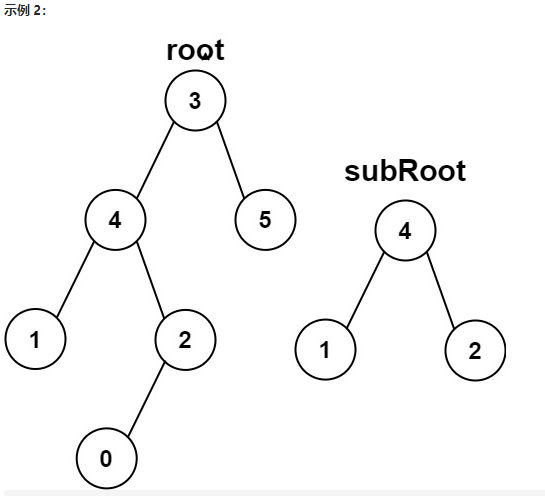

# 递归算法

## 需要辅助函数的递归

### [剑指 Offer 26. 树的子结构](https://leetcode-cn.com/problems/shu-de-zi-jie-gou-lcof/)

题目描述：输入两棵二叉树A和B，判断B是不是A的子结构。(约定空树不是任意一个树的子结构)

```C++
class Solution {
public:
    // 主函数，用于遍历 A 中所有节点，并调用help()进行判断
    bool isSubStructure(TreeNode* A, TreeNode* B) {
        // !B -> 题目约定空树不是任意一个树的子结构
        if(!A || !B) return false;
        bool res = false;

        // 如果在 A 中匹配到了 B 的根节点的值一样的节点
        if(A->val == B->val) res = helper(A, B);

        // 如果匹配不到，则向左子树或右子树搜索
        if(!res) res = isSubStructure(A->left, B) || isSubStructure(A->right, B);
        

        return res;
    }

    // 辅助函数，用于判断 A 中当前节点能否作为 B 的根节点
    bool helper(TreeNode* A, TreeNode* B){
        // 如果 B 已经遍历完了，则true
        if(B == NULL) return true;
        // 如果 B 还有，但是A已经空了，则false
        if(A == NULL) return false;
        // 不相等
        if(A->val != B->val) return false;

        return helper(A->left, B->left) && helper(A->right, B->right);
    }
};
```

`注意` 

1. 需要十分注意这一部分的代码，递归函数中嵌套了另一个递归函数

   ```C++
   // 如果在 A 中匹配到了 B 的根节点的值一样的节点
   if(A->val == B->val) res = helper(A, B);
   
   // 如果匹配不到，则向左子树或右子树搜索
   if(!res) res = isSubStructure(A->left, B) || isSubStructure(A->right, B);
   ```

2. 详见[树的子结构和子树](./二叉树的处理.md)

### [572. 另一棵树的子树★](https://leetcode-cn.com/problems/subtree-of-another-tree/)

题目描述：给你两棵二叉树 root 和 subRoot 。检验 root 中是否包含和 subRoot 具有相同结构和节点值的子树。如果存在，返回 true ；否则，返回 false

`本题和剑指26题的区别在于`判断一棵树是否是另一棵树的子结构，注意`子结构`与`子树`的区别

`子树` 二叉树 tree 的一棵子树包括 tree 的某个节点和这**个节点的所有后代节点**

如下图所示：subRoot 是 root 的`子结构` 但不是 `子树`



```C++
class Solution {
public:
    bool isSubtree(TreeNode* root, TreeNode* subRoot) {
        if(root == NULL || subRoot == NULL) return false;
        bool res = false;

        if(root->val == subRoot->val) res = helper(root, subRoot);
        if(!res) res = isSubtree(root->left, subRoot) || isSubtree(root->right, subRoot);

        return res;
    }

    bool helper(TreeNode* A, TreeNode* B){
        if(B == NULL && A == NULL) return true;
        if(A == NULL || B == NULL) return false;

        // 不相等
        if(A->val != B->val) return false;

        return helper(A->left, B->left) && helper(A->right, B->right);
    }
};
```

`注` 

1. 和上一题相比，主函数没有区别，还是遍历的去搜索二叉树的每一个节点；辅助函数有差别：

```C++
// 只有当两者都完全匹配到最后时候，才返回true，而不仅仅是B匹配完就行了
if(B == NULL && A == NULL) return true;
// A 为匹配完或者 B 匹配完都不行
if(A == NULL || B == NULL) return false;
```

### [剑指 Offer 28. 对称的二叉树](https://leetcode-cn.com/problems/dui-cheng-de-er-cha-shu-lcof/)

题目描述：请实现一个函数，用来判断一棵二叉树是不是对称的。如果一棵二叉树和它的镜像一样，那么它是对称的

```C++
class Solution {
public:
    bool isSymmetric(TreeNode* root) {
        if(root == NULL) return true;

        return helper(root->left, root->right);
    }

    // 用来判断两个树是否是镜像对称的
    bool helper(TreeNode* A, TreeNode* B){
        // 递归出口
        if(A == NULL && B == NULL) return true;
        if(A == NULL || B == NULL) return false;

        if(A->val != B->val) return false;

        // 如果相等，继续判断子树
        return helper(A->left, B->right) && helper(A->right, B->left);
    }
};
```

`注`

1. 其实，这一题的$helper()$​函数 和上一题判断二叉树的子树的十分相似，他们的作用都为两个子树是否 “一致/对称”，因此这个$helper()$​函数可以记一下

#### [剑指 Offer 33. 二叉搜索树的后序遍历序列](https://leetcode-cn.com/problems/er-cha-sou-suo-shu-de-hou-xu-bian-li-xu-lie-lcof/)

题目描述：输入一个整数数组，判断该数组是不是某二叉搜索树的后序遍历结果。如果是则返回true，否则返回 false。假设输入的数组的任意两个数字都互不相同

```C++
class Solution {
public:
    bool verifyPostorder(vector<int>& postorder) {
        return helper(postorder, 0, postorder.size() - 1);
    }

    bool helper(vector<int>& postorder, int left, int right){
        // 递归出口
        // 注意：这里的条件必须写成 left >= right 不可以写成 left == right
        // 这是因为要考虑到 例如递归到数组中只剩下2个数 [1, 2] 此时 mid最后==right，执行helper(postorder, mid, right - 1)，
        // 内部变量 left == 1, right == 0,将会出错
        if(left >= right) return true;

        int mid = left;
        int root = postorder[right];

        //从左往右找出第一个比根节点大的值，他后面的都是根节点的右子节点
        while(postorder[mid] < root){
            mid++;
        }

        int temp = mid;
        //因为postorder[mid]前面的值都是比根节点root小的,还需要确定postorder[mid]后面的值都要比根节点root大
        while(temp < right){
            if(postorder[temp] < root){
                return false;
            }
            temp++;
        }

        //然后对左右子节点进行递归调用
        return helper(postorder, left, mid - 1) && helper(postorder, mid, right - 1);
    }
};
```

`注`

1. 这里需要特别注意的是递归出口的条件：这里的条件必须写成 $left >= right$ 不可以写成 $left == right$​，这是因为要考虑到 例如递归到数组中只剩下2个数 [1, 2] 此时 mid最后==right，执行helper(postorder, mid, right - 1)，内部变量 left == 1, right == 0, 将会出错


## 不带辅助函数的递归

### [剑指 Offer 27. 二叉树的镜像](https://leetcode-cn.com/problems/er-cha-shu-de-jing-xiang-lcof/)

题目描述：请完成一个函数，输入一个二叉树，该函数输出它的镜像

```C++
class Solution {
public:
    TreeNode* mirrorTree(TreeNode* root) {
        if(root == NULL) return NULL;
        
        // 先序遍历位置，交换左右子树
        TreeNode* temp = root->left;
        root->left = root->right;
        root->right = temp;

        mirrorTree(root->left);
        mirrorTree(root->right);

        return root;
    }
};
```

`注` 

1. 应用了二叉树的`先序遍历`，先翻转二叉树的左右子节点；然后递归的反转其左右子树

2. 递归的返回值不一定要赋给某个变量

        mirrorTree(root->left);
        mirrorTree(root->right);

